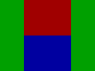
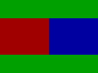
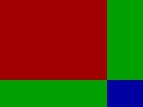
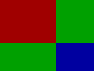
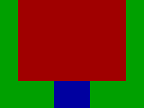
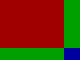
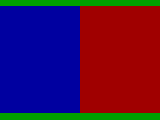
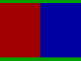

# NDS Emulator (DraStic) for Handheld Devices
This repository contains all necessary resources - including the customized SDL2 and ALSA source code - required for supported devices. The NDS emulator used in this project is DraStic (closed-source), extracted from the RetroPie package. The provided ELF binary is compiled for ARM32, not AArch64. The specific DraStic version is v2.5.0.4 with the SHA-1 checksum **ae9c215bdea88359cbcb3c259ce0d60a1f59986c**. This port primarily focuses on integrating and customizing the SDL2 and ALSA libraries, along with extensive modifications to the DraStic emulator itself. As a result, several internal hooking points are used to ensure proper functionality. Please ensure that you are using the exact DraStic version specified above. Suggestions and issue reports are welcome via GitHub. However, please note that I cannot guarantee that all reported issues or feature requests will be resolved or included in future release builds. Finally, since the SDL2 library in this repository is heavily customized, it is not recommended for general-purpose use on other supported devices.

 - [Miyoo Flip](#miyoo_flip)

&nbsp;

## Miyoo Flip
N0  
  

N1  
  

N2  
  

N3  
  

N4  
  

N5  
  

N6  
  

N7  
  

N8  
  

N9  
  

N10  
  

N11  
  

N12  
  

N13  
  

N14  
  

N15  
  

B0  
  

B1  
  

B2  
  

B3  
  

&nbsp;

The HOTKEY is user-configurable and can be rebound to the MENU or SELECT key via the SDL2 menu.    

| ( Keypad Mode )       | (Function)                          |
| --------------------- | ----------------------------------- |
| R2                    | Swap Screen                         |
| L2                    | Switch Keypad or Touch Mode         |
| HOTKEY + UP           | Toggle Microphone                   |
| HOTKEY + DOWN         | Toggle LCD Hinge                    |
| HOTKEY + LEFT         | Change Layout Mode                  |
| HOTKEY + RIGHT        | Change Layout Mode                  |
| HOTKEY + A            | Alternate Layout Mode               |
| HOTKEY + B            | Change Filter (Blur or Pixel)       |
| HOTKEY + X            | Show Help                           |
| HOTKEY + Y            | Change Background Image             |
| HOTKEY + L1           | Quit Emulator                       |
| HOTKEY + L2           | Load State                          |
| HOTKEY + R1           | Fast Forward                        |
| HOTKEY + R2           | Save State                          |
| HOTKEY + SELECT       | Enter DraStic Menu                  |
| HOTKEY + START        | Enter SDL2 Menu                     |  
| ( Touch Mode )        |                                     |
| DPAD                  | Move Touch                          |
| A                     | Touch Screen                        |
| R1                    | Lower Moving Speed                  |
| HOTKEY + Y            | Change Touch Image                  |  
| ( SDL2 Menu )         |                                     |
| HOTKEY + Y            | Change Background Image             |  
| ( Drastic Menu )      |                                     |
| HOTKEY + Y            | Change Background Image             |
