# NDS Emulator (DraStic) for Miyoo Handheld
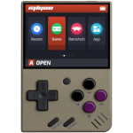 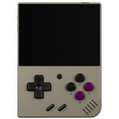 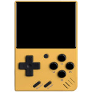 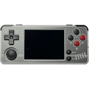  

&nbsp;

 - [Introduction](#introduction)
 - [Terminology](#terminology)
 - [Building](#building)
 - [Unit Test](#unit-test)
 - [Special Thanks](#special-thanks)
 - Supported Devices
   -  [Miyoo Mini (Plus)](#miyoo-mini-plus)
   -  [Miyoo Mini v4](#miyoo-mini-v4)

&nbsp;

## Introduction
This repository hosts all of resources, which include SDL2 and ALSA source code, needed for supported devices. The NDS emulator I used is DraStic emulator (closed-source) which was extracted from RetroPie package and the ELF binary is in ARM32 format, not AArch64. The DraStic version is v2.5.0.4 and sha1 is ae9c215bdea88359cbcb3c259ce0d60a1f59986c. In this porting, I focused on SDL2 and ALSA libraries and heavily customized on DraStic emulator. So, there are some hooking points used in this emulator and to ensure it works properly, please use the correct DraStic emulator as mentioned before. It is welcome to file any suggestion or issue on this GitHub but I must say that I cannot make sure whether it can be fixed or included in the release build. Since the SDL2 library used in this repository is heavily customized, therefore, it is not recommended for generic use-case on any supported device.  

&nbsp;

|  Terminology                         | Description                                                                                                                                                                     |
| ------------------------------------ | ------------------------------------------------------------------------------------------------------------------------------------------------------------------------------- |
| Keypad Mode                          | This is the default mode and it is so-called gamepad mode.                                                                                                                      |
| Stylus, Touch, Touch Pen or Pen Mode | It is touch mode. In this mode, the touch pen shows on either top or bottom screen. DPAD is used to move touch pen and A button acts touch point.                               |
| DraStic Menu                         | The default DraStic menu.                                                                                                                                                       |
| Customized Menu                      | It is a special menu to customize all of settings for my porting. This menu is not DraStic menu. So, I called the customized menu.                                              |
| Normal Resolution                    | This is the default display resolution on DraStic emulator and the resolution is 256x192 pixels.                                                                                |
| High Resolution                      | Turn on "Change Options -> High-resolution 3D" in DraStic menu and then the display resolution will be changed to 512x384 pixels. In this mode, only single screen is rendered. |
| Wallpaper, Background Image or Theme | It is background image.                                                                                                                                                         |

&nbsp;

## Building
### How to prepare the docker environment
```
$ sudo docker build -t miyoo .
```

### How to delete the docker environment
```
$ sudo docker image rm miyoo
```

### How to build source code in docker environment
```
$ sudo docker run -it --rm -u $(id -u ${USER}):$(id -g ${USER}) -v $(pwd):/nds miyoo /bin/bash
$ cd /nds
$ make -f Makefile.mini clean
$ make -f Makefile.mini
$ make -f Makefile.mini rel
```

&nbsp;

## Special Thanks
```
河馬
路人乙
背包胖熊
雯瑾文曦
Onion Development Team
DraStic Development Team
Miyoo Mini 掌機 QQ 群 (742661857)
```

&nbsp;

## Supported Devices
### Miyoo Mini (Plus)
   

#### Layout 0, Screen0: 640x480, Screen1: 170x128  
| 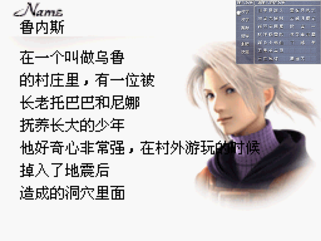 |
|-|

&nbsp;

#### Layout 1, Screen0: 640x480, Screen1: 256x192  
| 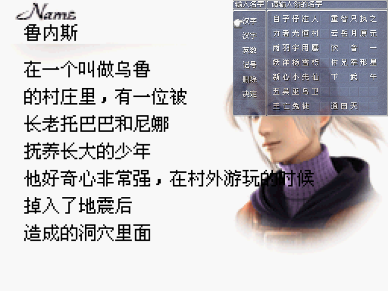 |
|-|

&nbsp;

#### Layout 2, Screen0: 512x384, Image: bg_s0.png  
|  |
|-|

&nbsp;

#### Layout 3, Screen0: 640x480  
| 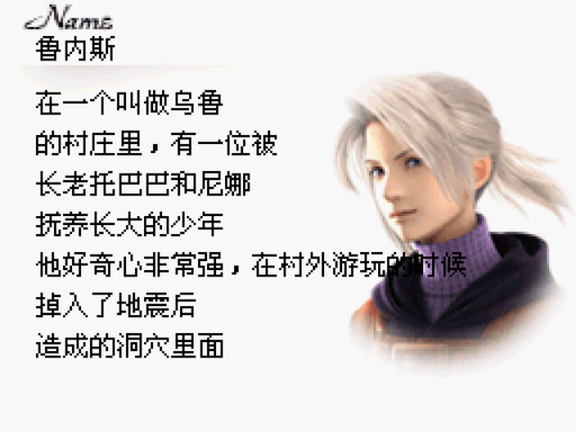 |
|-|

&nbsp;

#### Layout 4, Screen0: 256x192, Screen1: 256x192, Image: bg_v0.png  
| 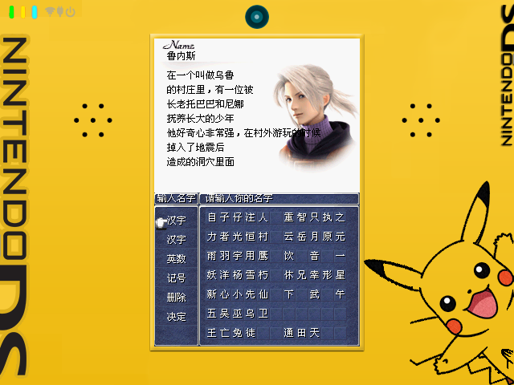 |
|-|

&nbsp;

#### Layout 5, Screen0: 320x240, Screen1: 320x240, Image: bg_v1.png  
| 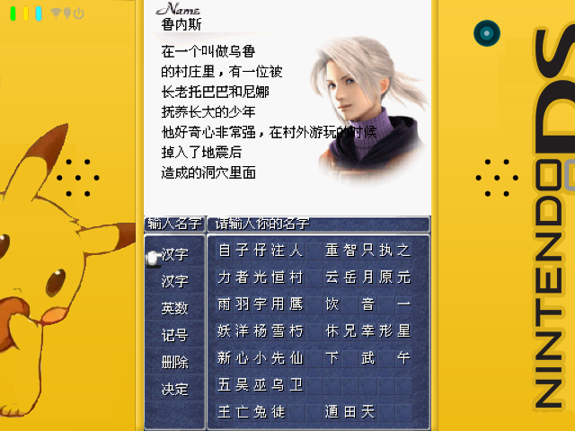 |
|-|

&nbsp;

#### Layout 6, Screen0: 256x192, Screen1: 256x192, Image: bg_h0.png  
| 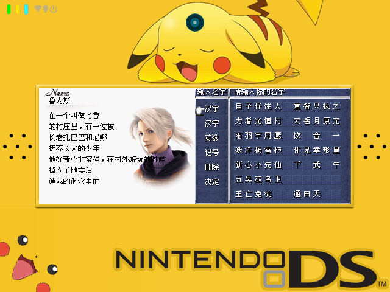 |
|-|

&nbsp;

#### Layout 7, Screen0: 320x240, Screen1: 320x240, Image: bg_h1.png  
| 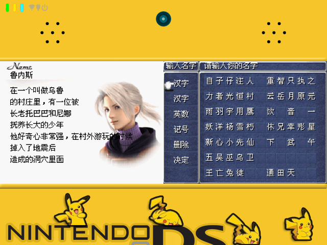 |
|-|

&nbsp;

#### Layout 8, Screen0: 480x360, Screen1: 160x120, Image: bg_vh_s0.png  
|  |
|-|

&nbsp;

#### Layout 9, Screen0: 384x288, Screen1: 256x192, Image: bg_vh_s1.png  
| 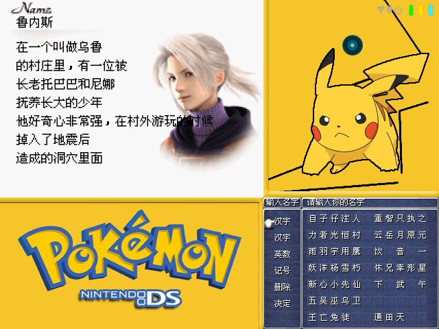 |
|-|

&nbsp;

#### Layout 10, Screen0: 384x288, Screen1: 256x192, Image: bg_vh_c0.png  
| 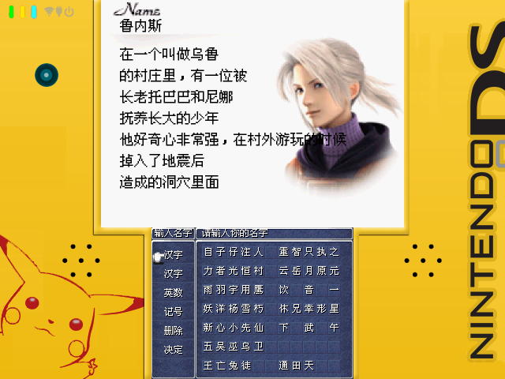 |
|-|

&nbsp;

#### Layout 11, Screen0: 384x288, Screen1: 256x192, Image: bg_vh_c1.png  
| 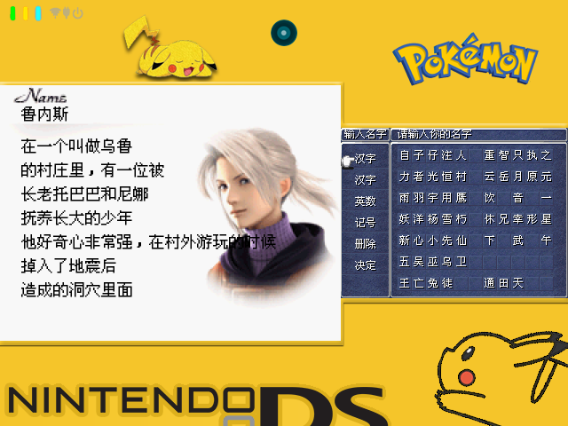 |
|-|

&nbsp;

#### Layout 12, Screen0: 427x320, Screen1: 427x320, Image: bg_hh0.png  
| 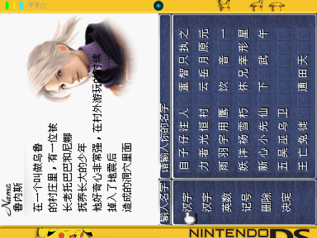 |
|-|

&nbsp;

#### Layout 13, Screen0: 427x320, Screen1: 427x320, Image: bg_hh0.png  
| 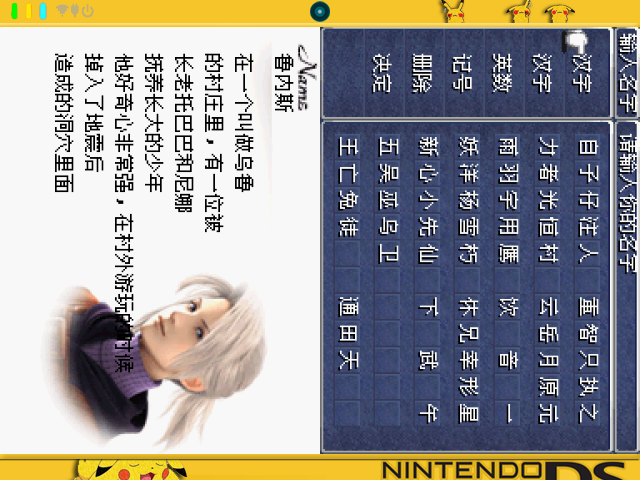 |
|-|

&nbsp;

#### Layout 14, Screen0: 512x384, Image: bg_hres0.png  
| 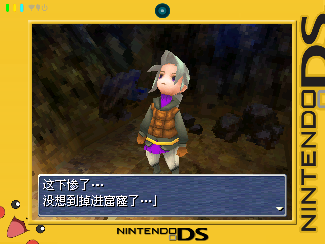 |
|-|

&nbsp;

#### Layout 15, Screen0: 640x480
|  |
|-|

&nbsp;

#### Video Filter: Pixel  
|  |
|-|

&nbsp;

#### Video Filter: Blur  
| 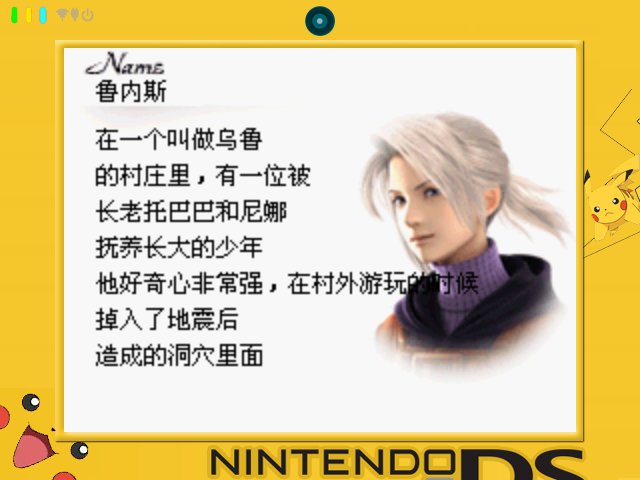 |
|-|

&nbsp;

#### DraStic Menu: Original  
|  |
|-|

&nbsp;

#### DraStic Menu: Refined  
| 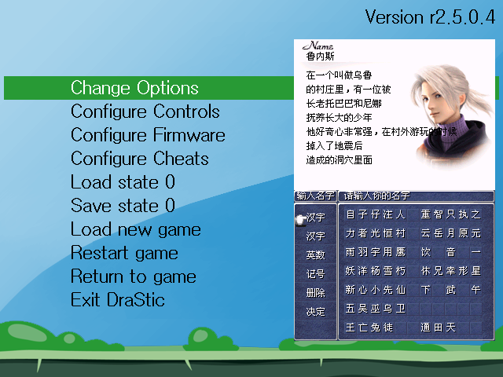 |
|-|

&nbsp;

#### Cheat Menu: Original  
| 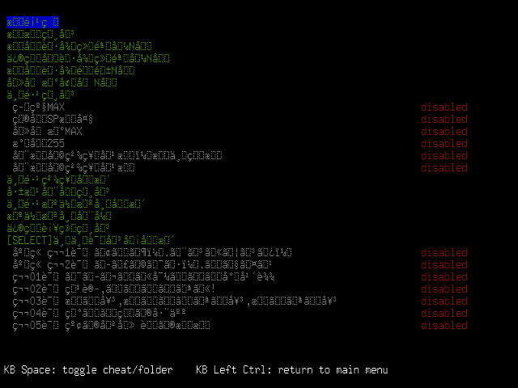 |
|-|

&nbsp;

#### Cheat Menu: Refined  
| 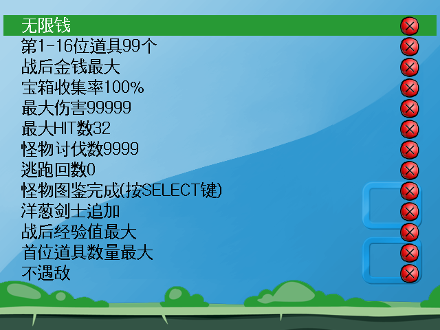 |
|-|

&nbsp;

#### Customized Menu  
|  |
|-|
```
Language:      Display language
CPU:           CPU clock
Overlay:       Overlay image
Display:       Display Layout
    Alpha:     The alpha value for small screen   (only work on "layout 0" and "layout 1")
    Border:    The border color for small screen  (only work on "layout 0" and "layout 1")
    Position:  The position for small screen      (only work on "layout 0" and "layout 1")
Alt. Display:  Alternative display layout
Keys:          Key rotation
Hotkey:        Hotkey binding
Swap L1-L2:    Swap L1 and L2
Swap R1-R2:    Swap R1 and R2
Pen X Speed:   The moving speed for X axis
Pen Y Speed:   The moving speed for Y axis
Cursor:        Show or hide cursor
Fast Forward:  The speed setting for fast forward 
```

&nbsp;

#### Hotkeys
|  Keys               | Description                         |
| ------------------- | ----------------------------------- |
| R2                  | Swap screen                         |
| L2                  | Change Keypad mode / Stylus mode    |
| MENU + LEFT         | Change the display layout           |
| MENU + RIGHT        | Change the display layout           |
| MENU + L1           | Exit from DraStic emulator          |
| MENU + L2           | Quick load state                    |
| MENU + R1           | Fast forward                        |
| MENU + R2           | Quick save state                    |
| **Customized Menu** |                                     |
| UP / DOWN           | Select item                         |
| LEFT / RIGHT        | Change setting                      |
| B                   | Apply change and then exit          |
| **Keypad Mode**     |                                     |
| MENU + A            | Alternate display layout            |
| MENU + B            | Change video filter (blur or pixel) |
| MENU + Y            | Change background image             |
| MENU + SELECT       | Enter the DraStic menu              |
| MENU + START        | Enter the customized menu           |
| **Stylus Mode**     |                                     |
| DPAD                | Move the pen                        |
| A                   | Touch screen                        |
| R1                  | Lower moving speed                  |
| MENU + UP           | Show the pen on screen 1            |
| MENU + DOWN         | Show the pen on screen 0            |
| MENU + Y            | Change the pen image                |

&nbsp;

#### Setting File (drastic/resources/settings.json)
```
"pen":          The index of pen image 
"theme":        The index of theme image
"mode":         The index of display layout
"xv":           The moving speed for X axis
"yv":           The moving speed for Y axis
"alpha":        The alpha value for small screen  (only work on "layout 0" and "layout 1")
"position":     The position for small screen     (only work on "layout 0" and "layout 1")
"border":       The border color for small screen (only work on "layout 0" and "layout 1")
"maxcpu":       The maximum CPU clock
"touchpad":     The screen index of stylus 
"overlay":      The index of overlay image
"mincpu":       The minimum CPU clock
"alt":          The alternative display mode
"swap_l1l2":    Swap L1 and L2
"swap_r1r2":    Swap R1 and R2
"lang":         Display language
"keys_rotate":  Key rotation (DPAD and 4 face keys)
"menu_c0":      Customized menu color (text color when select)
"menu_c1":      Customized menu color (text color when un-select)
"menu_c2":      Customized menu color (highlight color)
"auto_state":   Enable autosave and autoload
"auto_slot":    The slot of autosave and autoload
"half_vol":     The half of volume (only work for Stock system)
"splash":       The display count for splash application
"hotkey":       Bind hotkey with MENU or SELECT key
"states":       Savestate folder
"menu_bg":      The index of theme image for menu
"menu_cursor":  Show or hide menu cursor
"fast_forward": The speed value of fast forward
```

&nbsp;

### Installation
```
1. Place drastic folder in Emu folder
2. Place NDS roms in Roms/NDS folder
```

&nbsp;

### Q & A
**Q1: How to add a new language ?**
```
Step 1: add the new language file in "resources/translate" folder, ex: resources/translate/jp
Step 2: replace font.ttf file which supports your target language in "resources/font" folder
Step 3: change the language in the customized menu
```

&nbsp;

**Q2: How to customize the DraStic menu ?**
```
The background and cursor images are put in "resources/menu" folder.
The color can be set in "resources/settings.json" file as the following:
    "menu_c0":"0xffffff"    Text color when select
    "menu_c1":"0x000000"    Text color when un-select
    "menu_c2":"0x289a35"    Highlight color
```

&nbsp;

**Q3: How to apply the overlay image ?**
```
Place image in "resources/overlay" folder.
Go to the customized menu and then change the "Overlay" setting to apply it.
Please note that the background image will be disabled when the "Overlay" setting is enabled.
```

&nbsp;

**Q4: How to change the initial CPU clock ?**
```
Change "./cpuclock 1500" to what you want. (1500 = 1500MHz = 1.5GHz)  
For Miyoo Mini, the maximum CPU clock should be <= 1550MHz (experimental value)  
For Miyoo Mini Plus, the maximum CPU clock should be <= 1850MHz (experimental value)  
```

&nbsp;

**Q5: How to change the maximum/minimum CPU clock ?**
```
Change the "maxcpu"/"minpcu" value in "resources/settings.json" file.  
```

&nbsp;

**Q6: How to add a new wallpaper (so-called background image or theme) ?**
```
All wallpapers are put in "resources/bg_640" and "resources/bg_752" folders by the screen resolution.
```

&nbsp;

**Q7: How to add a new image for pen ?**
```
All of pen images are placed in "resources/pen" folder.
The touch point is set by the suffix file name.
For example, if the file name is 1_lt.png, it means the touch point is at left-top (_lt).
Here are the supported positions:
    xxx_lb.png: left-bottom
    xxx_lt.png: left-top
    xxx_rb.png: right-bottom
    xxx_rt.png: right-top 
```

&nbsp;

**Q8: How to enable high resolution 3D mode ?**
```
Turn on "Hight-resolution 3D" settings in DraStic menu.
The display resolution will be changed from 256x192 to 512x384 pixels.
```

&nbsp;

**Q9: Workaround (if DraStic emulator always shows white or black screen)**
```
Go to DraStic menu and then select "Restart Game".
```

&nbsp;

### Miyoo Mini v4
  

#### Layout 0, Screen0: 752x560, Screen1: 170x128  
| 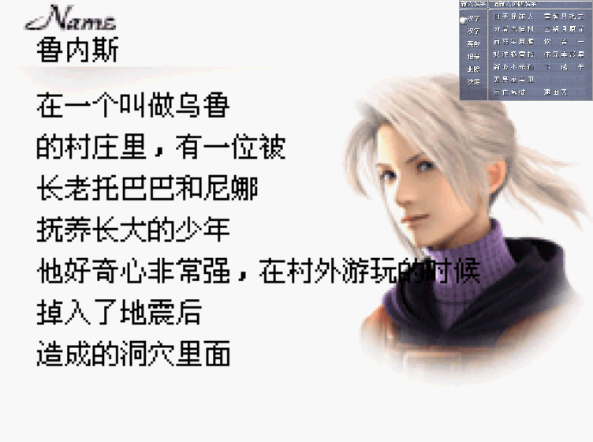 |
|-|

&nbsp;

#### Layout 1, Screen0: 752x560, Screen1: 256x192  
| 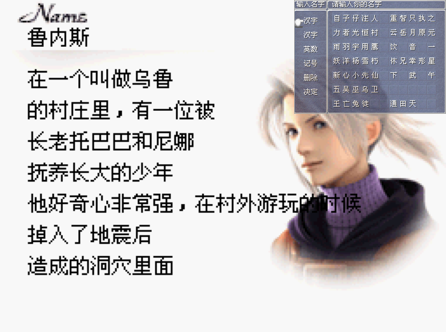 |
|-|

&nbsp;

#### Layout 2, Screen0: 512x384, Image: bg_s0.png  
| 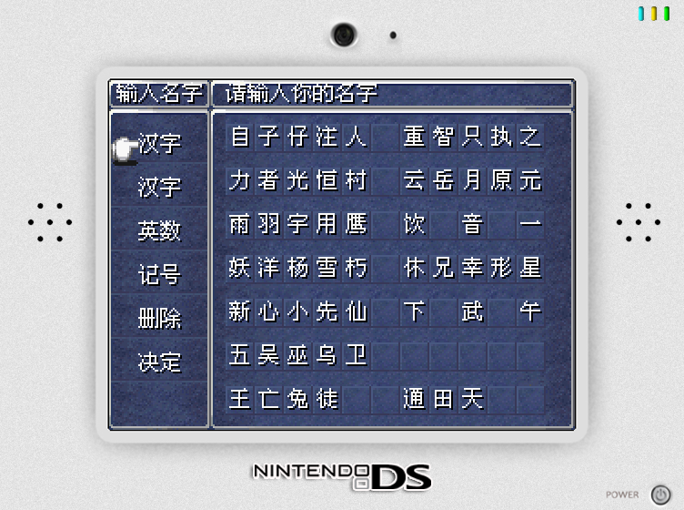 |
|-|

&nbsp;

#### Layout 3, Screen0: 752x560  
| 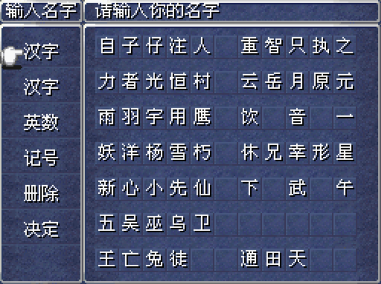 |
|-|

&nbsp;

#### Layout 4, Screen0: 256x192, Screen1: 256x192, Image: bg_v0.png  
| 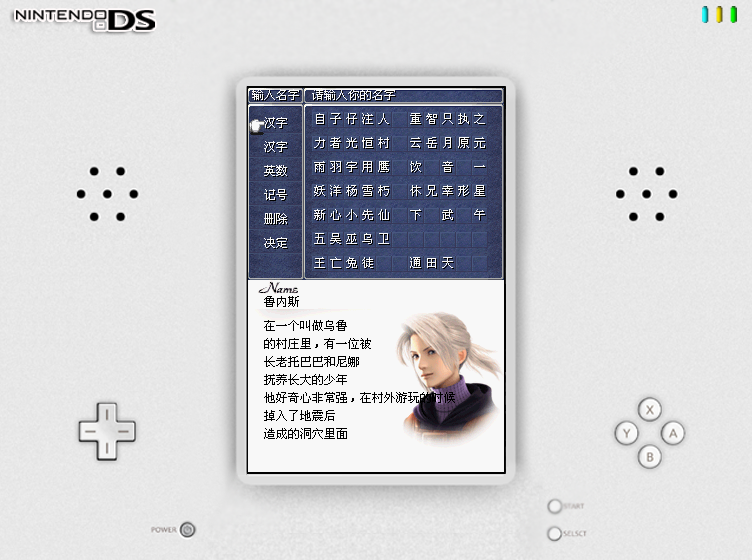 |
|-|

&nbsp;

#### Layout 5, Screen0: 373x280, Screen1: 373x280, Image: bg_v1.png  
| 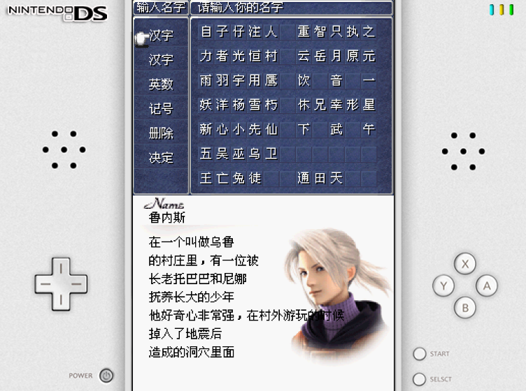 |
|-|

&nbsp;

#### Layout 6, Screen0: 256x192, Screen1: 256x192, Image: bg_h0.png  
| 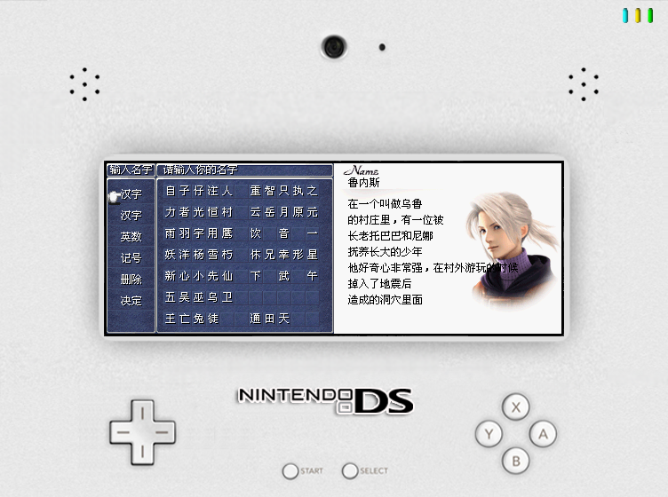 |
|-|

&nbsp;

#### Layout 7, Screen0: 373x280, Screen1: 373x280, Image: bg_h1.png  
| 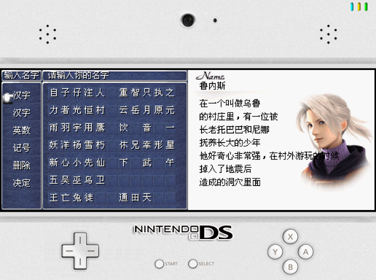 |
|-|

&nbsp;

#### Layout 8, Screen0: 592x440, Screen1: 160x120, Image: bg_vh_s0.png  
| 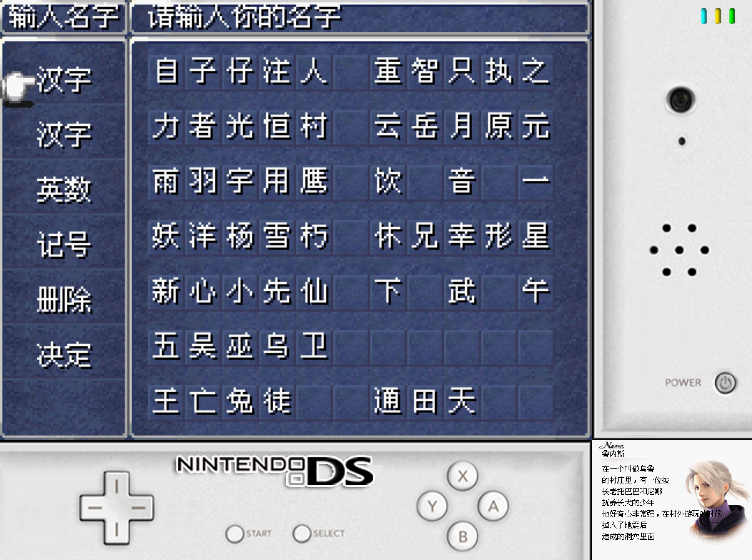 |
|-|

&nbsp;

#### Layout 9, Screen0: 496x368, Screen1: 256x192, Image: bg_vh_s1.png  
| 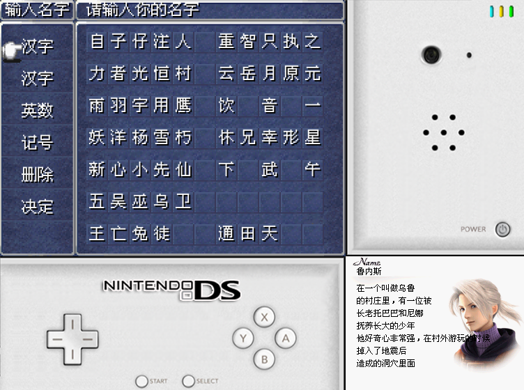 |
|-|

&nbsp;

#### Layout 10, Screen0: 496x368, Screen1: 256x192, Image: bg_vh_c0.png  
| 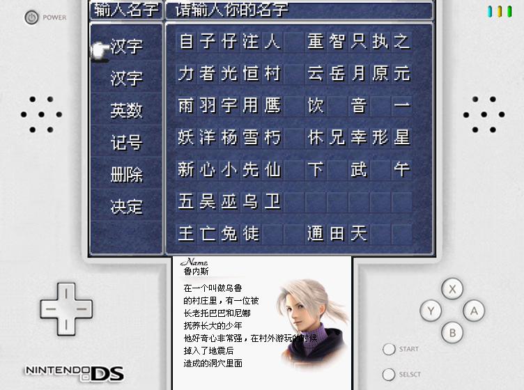 |
|-|

&nbsp;

#### Layout 11, Screen0: 496x368, Screen1: 256x192, Image: bg_vh_c1.png  
| 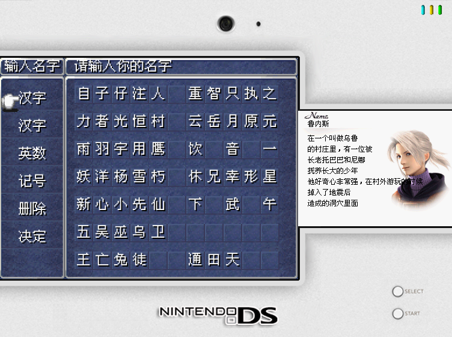 |
|-|

&nbsp;

#### Layout 12, Screen0: 501x376, Screen1: 501x376, Image: bg_hh0.png  
| 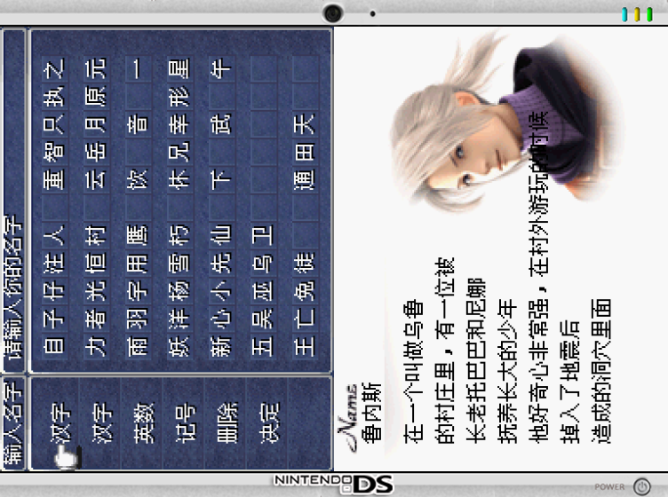 |
|-|

&nbsp;

#### Layout 13, Screen0: 501x376, Screen1: 501x376, Image: bg_hh0.png  
| 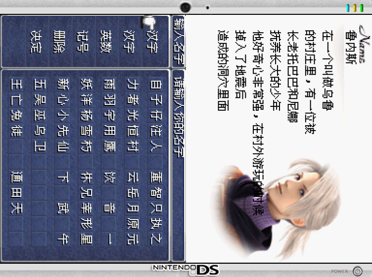 |
|-|

&nbsp;

### Layout 14, Screen0: 512x384, Image: bg_hres0.png  
| 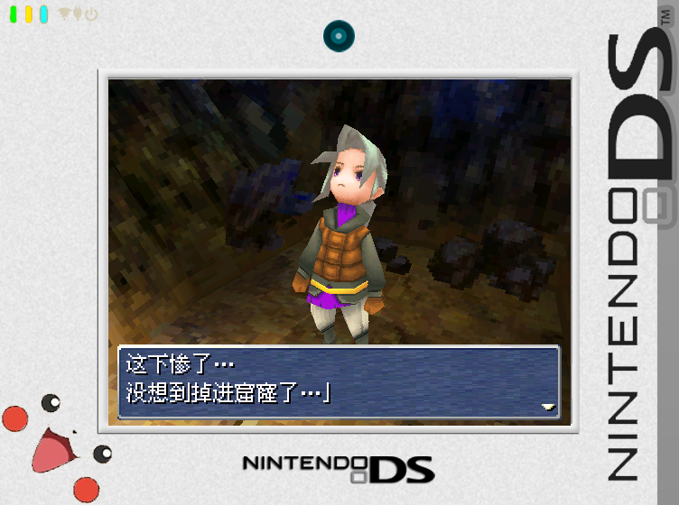 |
|-|

&nbsp;

#### Layout 15, Screen0: 752x560  
| 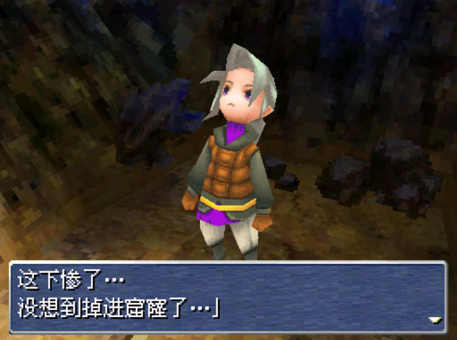 |
|-|
