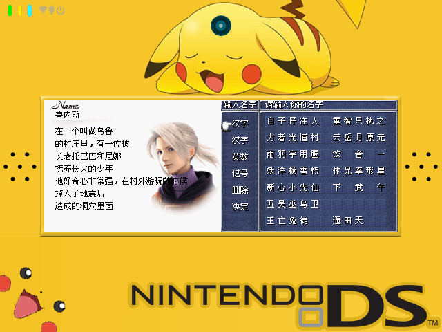
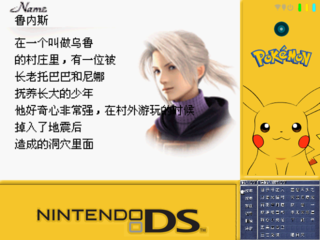
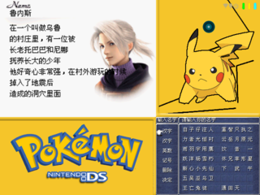
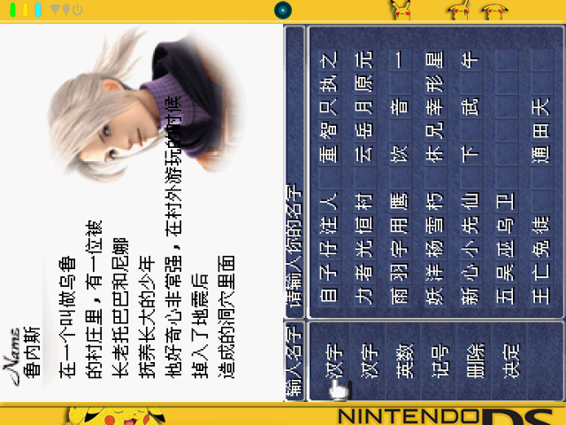
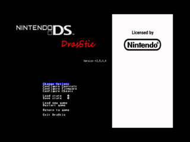
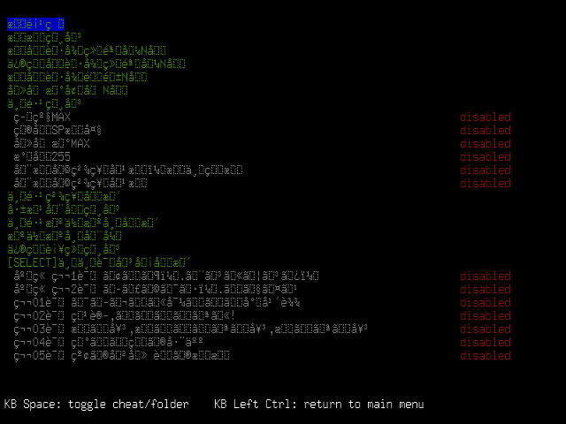
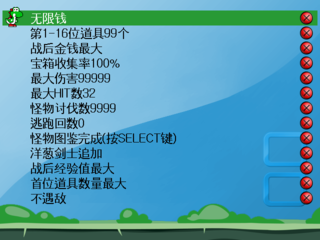
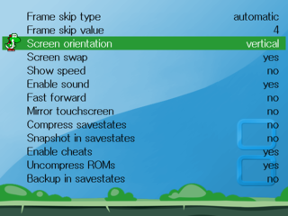

# NDS Emulator (DraStic) for Miyoo Mini (Plus)
 - [Introduction](#introduction)
 - [Display Modes](#display-modes)
   - [Mode 0 - 640x480, 170x128](#mode-0)
   - [Mode 1 - 640x480, 256x192](#mode-1)
   - [Mode 2 - 512x384](#mode-2)
   - [Mode 3 - 640x480](#mode-3)
   - [Mode 4 - 256x192, 256x192](#mode-4)
   - [Mode 5 - 320x240, 320x240](#mode-5)
   - [Mode 6 - 256x192, 256x192](#mode-6)
   - [Mode 7 - 320x240, 320x240](#mode-7)
   - [Mode 8 - 480x360, 160x120](#mode-8)
   - [Mode 9 - 384x288, 256x192](#mode-9)
   - [Mode 10 - 384x288, 256x192](#mode-10)
   - [Mode 11 - 384x288, 256x192](#mode-11)
   - [Mode 12 - 427x320, 427x320](#mode-12)
 - [Display Modes (High Resolution)](#display-modes-high-resolution)
   - [Mode 0 - 512x384](#mode-0)
   - [Mode 1 - 640x480](#mode-1)
 - [Video Filters](#video-filters)
   - [Pixel](#pixel) 
   - [Blur](#blur)
 - [Refined Menu](#refined-menu)
 - [How to prepare the build environment (Docker)](#how-to-prepare-the-build-environment-docker)
 - [How to build SDL2 library](#how-to-build-sdl2-library)
 - [How to build ALSA library](#how-to-build-alsa-library)
 - [How to delete the build environment (Docker)](#how-to-delete-the-build-environment-docker)
 - [How to install on Miyoo Mini (Plus)](#how-to-install-on-miyoo-mini-plus)
 - [Limitations](#limitations)

## Introduction
This repository hosts all of resources, which include SDL2 and ALSA source code, needed for NDS emulator on Miyoo Mini (Plus) handheld. The NDS emulator we used is DraStic emulator (close-source) that obtained from RetroPie package and the ELF binary is in ARM32 format, not AArch64. The DraStic version is v2.5.0.4 and sha1 is ae9c215bdea88359cbcb3c259ce0d60a1f59986c. In this porting, I focusd on SDL2 and ALSA libraries and heavily customized for DraStic emulator on Miyoo Mini (Plus) handheld. Therefore, there are some hooking points used in this emulator. To make sure it works as expected, please use the correct DraStic emulator. It is welcome to file any suggestion or issue to this GitHub but I must say that I cannot make sure whether it can be fixed. Since this porting is heavily customized, it is not recommended for generic use-case on Miyoo Mini (Plus) handheld.

## Display Modes
### Mode 0
Screen Resolution: 640x480, 170x128
|  |
|-|

### Mode 1
Screen Resolution: 640x480, 256x192
|  |
|-|

### Mode 2
Screen Resolution: 512x384  
Background Image: bg_s0.png
|  |
|-|

### Mode 3
Screen Resolution: 640x480
|  |
|-|

### Mode 4
Screen Resolution: 256x192, 256x192  
Background Image: bg_v0.png
|  |
|-|

### Mode 5
Screen Resolution: 320x240, 320x240  
Background Image: bg_v1.png
|  |
|-|

### Mode 6
Screen Resolution: 256x192, 256x192  
Background Image: bg_h0.png
|  |
|-|

### Mode 7
Screen Resolution: 320x240, 320x240  
Background Image: bg_h1.png
|  |
|-|

### Mode 8
Screen Resolution: 480x360, 160x120  
Background Image: bg_s0.png
|  |
|-|

### Mode 9
Screen Resolution: 384x288, 256x192  
Background Image: bg_s1.png
|  |
|-|

### Mode 10
Screen Resolution: 384x288, 256x192  
Background Image: bg_c0.png
|  |
|-|

### Mode 11
Screen Resolution: 384x288, 256x192  
Background Image: bg_c1.png
|  |
|-|

### Mode 12
Screen Resolution: 427x320, 427x320  
Background Image: bg_hh0.png
|  |
|-|

## Display Modes (High Resolution)
### Mode 0
Screen Resolution: 512x384  
Background Image: bg_hres0.png
|  |
|-|

### Mode 1
Screen Resolution: 640x480
|  |
|-|

## Video Filters
### Pixel
|  |
|-|

### Blur
|  |
|-|

## Refined Menu
Original Main Menu
|  |
|-|

Refined Main Menu
|  |
|-|

Original Cheat Menu
|  |
|-|

Refined Cheat Menu
|  |
|-|

## How to prepare the build environment (Docker)
```
$ sudo docker build -t mmiyoo .
```

## How to build SDL2 library
```
$ sudo docker run -it --rm -v $(pwd):/nds_miyoo mmiyoo /bin/bash

# cd /nds_miyoo/sdl2
# export MOD=mmiyoo
# export CROSS=/opt/mmiyoo/bin/arm-linux-gnueabihf-
# export CC=${CROSS}gcc
# export AR=${CROSS}ar
# export AS=${CROSS}as
# export LD=${CROSS}ld
# export CXX=${CROSS}g++
# export HOST=arm-linux
# export PATH=/opt/mmiyoo/bin/:$PATH

# ./autogen.sh
# ./configure --disable-joystick-virtual --disable-sensor --disable-power --disable-alsa \
    --disable-diskaudio --disable-video-x11 --disable-video-wayland --disable-video-kmsdrm \
    --disable-video-vulkan --disable-dbus --disable-ime --disable-fcitx --disable-hidapi \ 
    --disable-pulseaudio --disable-sndio --disable-libudev --disable-jack --disable-video-opengl \
    --disable-video-opengles --disable-video-opengles2 --disable-oss --disable-dummyaudio \
    --disable-video-dummy --host=${HOST}

# make -j4 V=99
```

## How to build ALSA library
```
$ sudo docker run -it --rm -v $(pwd):/nds_miyoo mmiyoo /bin/bash

# cd /nds_miyoo/libasound
# export PATH=/opt/mmiyoo/bin/:$PATH
# make
```

## How to delete the build environment (Docker)
```
$ sudo docker image rm mmiyoo
```

## How to install on Miyoo Mini (Plus)
```
1. put drastic into Emu folder
2. put ROMs into Roms/NDS folder
```

## Limitations
 - Screen orientation MUST be set as vertical on DraStic menu as the following image because all of display modes are handled by SDL2 library, not DraStic emulator  
  
  
