# NDS Emulator (DraStic) for Miyoo Mini (Plus) and TRIMUI SMART
 - [Miyoo Mini (Plus)](#miyoo-mini-plus)
   - Introduction
   - Terminology
   - New Features
     - 640x480
       - Display Modes (Normal Resolution)
         - Mode 0 - 640x480, 170x128
         - Mode 1 - 640x480, 256x192
         - Mode 2 - 512x384
         - Mode 3 - 640x480
         - Mode 4 - 256x192, 256x192
         - Mode 5 - 320x240, 320x240
         - Mode 6 - 256x192, 256x192
         - Mode 7 - 320x240, 320x240
         - Mode 8 - 480x360, 160x120
         - Mode 9 - 384x288, 256x192
         - Mode 10 - 384x288, 256x192
         - Mode 11 - 384x288, 256x192
         - Mode 12 - 427x320, 427x320
         - Mode 13 - 427x320, 427x320
       - Display Modes (High Resolution)
         - Mode 14 - 512x384
         - Mode 15 - 640x480
     - 752x560
       - Display Modes (Normal Resolution)
         - Mode 0 - 752x560, 170x128
         - Mode 1 - 752x560, 256x192
         - Mode 2 - 512x384
         - Mode 3 - 752x560
         - Mode 4 - 256x192, 256x192
         - Mode 5 - 373x280, 373x280
         - Mode 6 - 256x192, 256x192
         - Mode 7 - 373x280, 373x280
         - Mode 8 - 592x440, 160x120
         - Mode 9 - 496x368, 256x192
         - Mode 10 - 496x368, 256x192
         - Mode 11 - 496x368, 256x192
         - Mode 12 - 501x376, 501x376
         - Mode 13 - 501x376, 501x376
       - Display Modes (High Resolution)
         - Mode 14 - 512x384
         - Mode 15 - 752x560
     - Video Filters
       - Pixel
       - Blur
     - DraStic Menu
     - Customized Menu
     - Hotkeys
     - Special Setting File (setting.json)
   - Build from Scratch
     - How to prepare the build environment (Docker)
     - How to build all libraries
     - How to pack the release build
     - How to delete the build environment (Docker)
   - Installation
   - Limitations
   - Special Thanks
   - Q & A
 - [TRIMUI SMART](#trimui-smart)
   - Introduction
   - Terminology
   - New Features
     - Display Modes
       - Mode 0 - 256x192
       - Mode 1 - 288x208
       - Mode 2 - 320x240
     - DraStic Menu
     - Hotkeys
   - Build from Scratch
     - How to prepare the build environment (Docker)
     - How to build all libraries
     - How to pack the release build
     - How to delete the build environment (Docker)
   - Installation
   - Limitations
   - Special Thanks

&nbsp;

## Miyoo Mini (Plus)
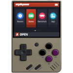 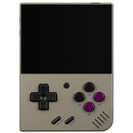  

### Introduction
This repository hosts all of resources, which include SDL2 and ALSA source code, needed for NDS emulator on Miyoo Mini (Plus) handheld. The NDS emulator I used is DraStic emulator (close-source) that obtained from RetroPie package and the ELF binary is in ARM32 format, not AArch64. The DraStic version is v2.5.0.4 and sha1 is ae9c215bdea88359cbcb3c259ce0d60a1f59986c. In this porting, I focusd on SDL2 and ALSA libraries and heavily customized for DraStic emulator on Miyoo Mini (Plus) handheld. Therefore, there are some hooking points used in this emulator. To make sure it works as expected, please use the correct DraStic emulator. It is welcome to file any suggestion or issue to this GitHub but I must say that I cannot make sure whether it can be fixed. Since this SDL2 porting is heavily customized, it is not recommended for generic use-case on Miyoo Mini (Plus) handheld.  

In DraStic emulator, it only supports 3 display modes, which are vertical, horizontal and single. In order to improve user experience on Miyoo Mini (Plus), I decided to heavily customize the display mode based on DraStic's vertical mode (Screen orientation). So, the "Screen orientation" MUST be set as vertical to make sure all of operations work on Miyoo Mini (Plus). In current design, there are 14 display modes for normal resolution (256x192) and 2 display modes for high resolution (512x384). All of display modes are addressed as the following description.

&nbsp;

### Terminology
|  Term             | Description                                                |
| ----------------- | ---------------------------------------------------------- |
| Keypad Mode       | This is the default mode and it is so-called gamepad mode. |
| Stylus Mode       | It is touch mode. In this mode, the touch pen shows on either top or bottom screen. DPAD is used to move touch pen and A button acts touch point. | 
| DraStic Menu      | The default DraStic menu. |
| Customized Menu   | It is a special menu to customize all of settings for my porting. This menu is not DraStic menu. So, I called the customized menu. |
| Normal Resolution | This is the default display resolution for DraStic emulator and the resolution is 256x192 pixels. If user doesn't turn on High-resolution mode in DraStic menu, it is the Normal Resolution. |
| High Resolution   | Turn on "Change Options -> High-resolution 3D" in DraStic menu and then the display resolution will be changed to 512x384 pixels. In this mode, only single screen is rendered. |
| 640x480           | All of Miyoo Mini (Plus) models except for Miyoo Mini (v4) have the LCD screen which can render up to 640x480 pixels. |
| 752x560           | Miyoo Mini (v4) has the LCD screen which can render up to 752x560 pixels. |

&nbsp;

### New Features
#### 640x480
##### Display Modes (Normal Resolution)
###### Mode 0
Screen Resolution: 640x480, 170x128
|  |
|-|

&nbsp;

###### Mode 1
Screen Resolution: 640x480, 256x192
|  |
|-|

&nbsp;

###### Mode 2
Screen Resolution: 512x384  
Background Image: bg_s0.png
|  |
|-|

&nbsp;

###### Mode 3
Screen Resolution: 640x480
|  |
|-|

&nbsp;

###### Mode 4
Screen Resolution: 256x192, 256x192  
Background Image: bg_v0.png
|  |
|-|

&nbsp;

###### Mode 5
Screen Resolution: 320x240, 320x240  
Background Image: bg_v1.png
|  |
|-|

&nbsp;

###### Mode 6
Screen Resolution: 256x192, 256x192  
Background Image: bg_h0.png
|  |
|-|

&nbsp;

###### Mode 7
Screen Resolution: 320x240, 320x240  
Background Image: bg_h1.png
|  |
|-|

&nbsp;

###### Mode 8
Screen Resolution: 480x360, 160x120  
Background Image: bg_vh_s0.png
|  |
|-|

&nbsp;

###### Mode 9
Screen Resolution: 384x288, 256x192  
Background Image: bg_vh_s1.png
|  |
|-|

&nbsp;

###### Mode 10
Screen Resolution: 384x288, 256x192  
Background Image: bg_vh_c0.png
|  |
|-|

&nbsp;

###### Mode 11
Screen Resolution: 384x288, 256x192  
Background Image: bg_vh_c1.png
|  |
|-|

&nbsp;

###### Mode 12
Screen Resolution: 427x320, 427x320  
Background Image: bg_hh0.png
|  |
|-|

&nbsp;

###### Mode 13
Screen Resolution: 427x320, 427x320  
Background Image: bg_hh0.png
|  |
|-|

&nbsp;

##### Display Modes (High Resolution)
###### Mode 14
Screen Resolution: 512x384  
Background Image: bg_hres0.png
|  |
|-|

&nbsp;

###### Mode 15
Screen Resolution: 640x480
|  |
|-|

&nbsp;

#### 752x560
##### Display Modes (Normal Resolution)
###### Mode 0
Screen Resolution: 752x560, 170x128
|  |
|-|

&nbsp;

###### Mode 1
Screen Resolution: 752x560, 256x192
|  |
|-|

&nbsp;

###### Mode 2
Screen Resolution: 512x384  
Background Image: bg_s0.png
|  |
|-|

&nbsp;

###### Mode 3
Screen Resolution: 752x560
|  |
|-|

&nbsp;

###### Mode 4
Screen Resolution: 256x192, 256x192  
Background Image: bg_v0.png
|  |
|-|

&nbsp;

###### Mode 5
Screen Resolution: 373x280, 373x280  
Background Image: bg_v1.png
| 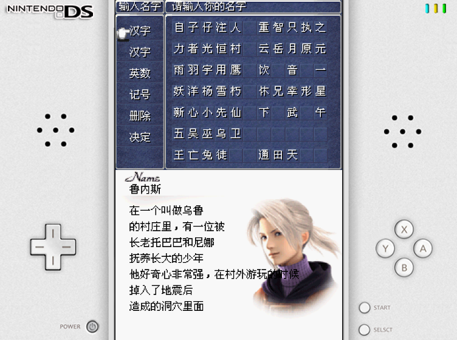 |
|-|

&nbsp;

###### Mode 6
Screen Resolution: 256x192, 256x192  
Background Image: bg_h0.png
| 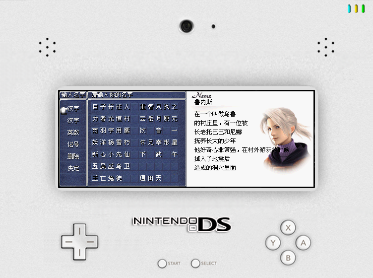 |
|-|

&nbsp;

###### Mode 7
Screen Resolution: 373x280, 373x280  
Background Image: bg_h1.png
|  |
|-|

&nbsp;

###### Mode 8
Screen Resolution: 592x440, 160x120  
Background Image: bg_vh_s0.png
|  |
|-|

&nbsp;

###### Mode 9
Screen Resolution: 496x368, 256x192  
Background Image: bg_vh_s1.png
|  |
|-|

&nbsp;

###### Mode 10
Screen Resolution: 496x368, 256x192  
Background Image: bg_vh_c0.png
| 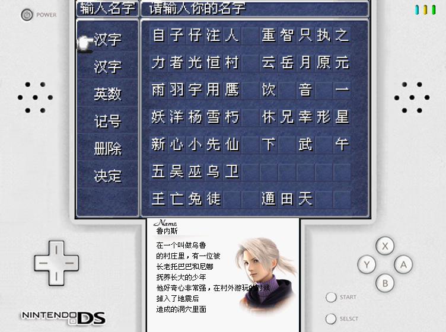 |
|-|

&nbsp;

###### Mode 11
Screen Resolution: 496x368, 256x192  
Background Image: bg_vh_c1.png
|  |
|-|

&nbsp;

###### Mode 12
Screen Resolution: 501x376, 501x376  
Background Image: bg_hh0.png
| 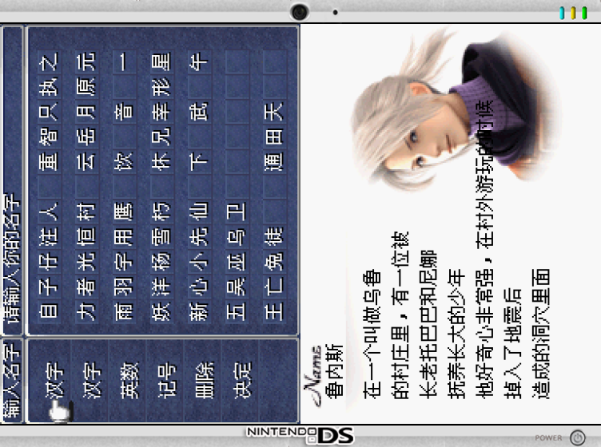 |
|-|

&nbsp;

###### Mode 13
Screen Resolution: 501x376, 501x376  
Background Image: bg_hh0.png
|  |
|-|

&nbsp;

##### Display Modes (High Resolution)
###### Mode 14
Screen Resolution: 512x384  
Background Image: bg_hres0.png
|  |
|-|

&nbsp;

###### Mode 15
Screen Resolution: 752x560
|  |
|-|

&nbsp;

#### Video Filters
##### Pixel
|  |
|-|

&nbsp;

##### Blur
| 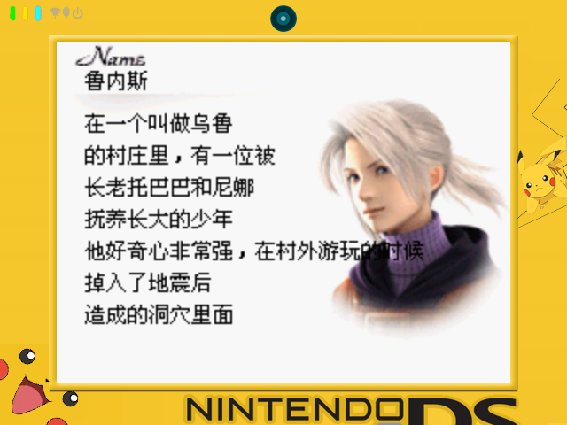 |
|-|

&nbsp;

#### DraStic Menu
Original Main Menu
|  |
|-|

&nbsp;

Refined Main Menu
|  |
|-|

&nbsp;

Original Cheat Menu
|  |
|-|

&nbsp;

Refined Cheat Menu
|  |
|-|

&nbsp;

#### Customized Menu
| 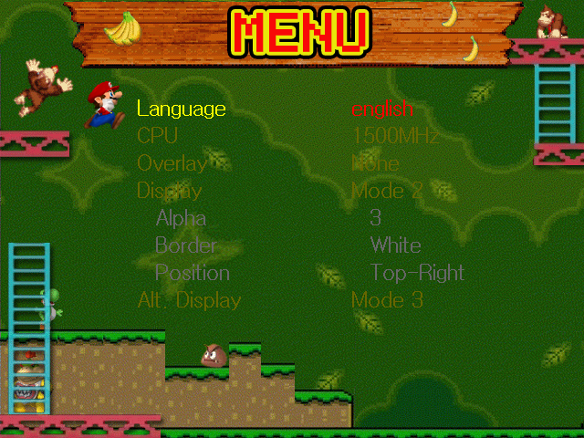 |
|-|
```
Language:      Display language
CPU:           CPU clock
Overlay:       Overlay image
Display:       Display mode
    Alpha:     The alpha value for small screen   (only work on "Mode 0" and "Mode 1")
    Border:    The border color for small screen  (only work on "Mode 0" and "Mode 1")
    Position:  The position for small screen      (only work on "Mode 0" and "Mode 1")
Alt. Display:  Alternative display mode
Keys:          Key rotation
Hotkey:        Hotkey binding
Swap L1-L2:    Swap L1 and L2
Swap R1-R2:    Swap R1 and R2
Pen X Speed:   The moving speed for X axis
Pen Y Speed:   The moving speed for Y axis
```

&nbsp;

#### Hotkeys
|  Keys         | Functionality                    |
| ------------- | -------------------------------- |
| R2            | Swap screen                      |
| L2            | Change Keypad mode / Stylus mode |
| MENU + LEFT   | Change the display mode          |
| MENU + RIGHT  | Change the display mode          |
| MENU + L1     | Exit from DraStic emulator       |
| MENU + L2     | Quick load state                 |
| MENU + R1     | Fast forward                     |
| MENU + R2     | Quick save state                 |

&nbsp;

**Customized menu only**
|  Keys        | Functionality                    |
| -----------  | -------------------------------- |
| UP / DOWN    | Select item                      |
| LEFT / RIGHT | Change setting                   |
| B            | Apply changes and then exit      |

&nbsp;

**Keypad mode only**
|  Keys         | Functionality                             |
| ------------- | ----------------------------------------- |
| MENU + A      | Alternate display mode                    |
| MENU + B      | Change video filter (blur or pixel)       |
| MENU + X      | Take screenshot (Emus/drastic/screenshot) |
| MENU + Y      | Change background image                   |
| MENU + SELECT | Enter the DraStic menu                    |
| MENU + START  | Enter the customized menu                 |

&nbsp;

**Stylus mode only**
|  Keys       | Functionality                   |
| ----------- | ------------------------------- |
| DPAD        | Move the stylus pen             |
| A           | Touch screen                    |
| R1          | Lower moving speed              |
| MENU + UP   | Show the stylus pen on screen 1 |
| MENU + DOWN | Show the stylus pen on screen 0 |
| MENU + Y    | Change stylus pen               |

&nbsp;

#### Special Setting File (setting.json)
File Path: drastic/resources/settings.json
```
"pen":          The index of pen image 
"theme":        The index of theme image
"mode":         The index of display mode
"xv":           The moving speed for X axis
"yv":           The moving speed for Y axis
"alpha":        The alpha value for small screen  (only work on "Mode 0" and "Mode 1")
"position":     The position for small screnn     (only work on "Mode 0" and "Mode 1")
"border":       The border color for small screen (only work on "Mode 0" and "Mode 1")
"maxcpu":       The maximum CPU clock
"touchpad":     The screen index of stylus 
"overlay":      The index of overlay image
"mincpu":       The minimum CPU clock
"alt":          The alternative display mode
"swap_l1l2":    Swap L1 and L2
"swap_r1r2":    Swap R1 and R2
"cust_menu":    Customized menu or DraStic menu
"lang":         Display language
"keys_rotate":  Key rotation (DPAD and 4 face keys)
"menu_c0":      Customized menu color (text color when select)
"menu_c1":      Customized menu color (text color when un-select)
"menu_c2":      Customized menu color (highlight color)
"auto_state":   Enable autosave and autoload
"auto_slot":    The slot of autosave and autoload
"half_vol":     The half of volume (only work for Stock system)
"splash":       The display count for splash application
"hotkey":       Bind hotkey with MENU or SELECT key
```

&nbsp;

### Build from Scratch
#### How to prepare the build environment (Docker)
```
$ sudo docker build -t mmiyoo .
```

#### How to build all libraries
```
$ sudo docker run -it --rm -v $(pwd):/nds_miyoo mmiyoo /bin/bash
# cd /nds_miyoo
# make config
# make
```

#### How to pack the release build
```
$ sudo docker run -it --rm -v $(pwd):/nds_miyoo mmiyoo /bin/bash
# cd /nds_miyoo
# make rel
```

#### How to delete the build environment (Docker)
```
$ sudo docker image rm mmiyoo
```

&nbsp;

### Installation
```
1. Put drastic into Emu folder
2. Put ROMs into Roms/NDS folder
```

&nbsp;

### Limitations
 - Screen orientation **MUST** be set as **vertical** in DraStic menu as the following image because all of display modes are handled by SDL2 library, not DraStic emulator  


&nbsp;

### Special Thanks
```
河馬
路人乙
背包胖熊
Miyoo Mini 掌機 QQ 群 (742661857)
Onion Development Team
DraStic Development Team
```

&nbsp;

### Q & A
**Q1: How to change the DraStic menu back to the original one ?**
```
Change the "cust_menu" value in "resources/settings.json" file to 0.
``` 

&nbsp;

**Q2: How to add a new language ?**
```
Step 1: add the new language file in "resources/translate" folder, ex: resources/translate/jp
Step 2: replace font.ttf file which supports your taregt language in "resources/font" folder
Step 3: change the language in the customized menu
```

&nbsp;

**Q3: How to customize the DraStic menu ?**
```
The background and cursor images are put in "resources/menu" folder.
The color can be changed in "resources/settings.json" file as the following:
    "menu_c0":"0xffffff"    Text color when select
    "menu_c1":"0x000000"    Text color when un-select
    "menu_c2":"0x289a35"    Highlight color
```

&nbsp;

**Q4: How to apply the overlay image ?**
```
Put image in "resources/overlay" folder.
Go to the customized menu and then change the "Overlay" setting to apply it.
Please note that the wallpaper will be disabled when the "Overlay" setting is enabled.
```

&nbsp;

**Q5: How to change the initial CPU clock ?**
```
Change "./cpuclock 1500" to what you want. (1500 = 1500MHz = 1.5GHz)  
For Miyoo Mini, the maximum CPU clock should be <= 1550MHz (experimental value)  
For Miyoo Mini Plus, the maximum CPU clock should be <= 1850MHz (experimental value)  
```

&nbsp;

**Q6: How to change the maximum/minimum CPU clock ?**
```
Change the "maxcpu"/"minpcu" value in "resources/settings.json" file.  
```

&nbsp;

**Q7: How to add new wallpaper (so-called background or theme image) ?**
```
All wallpapers are put in "resources/bg_640" and "resources/bg_752" folders.
```

&nbsp;

**Q8: How to use the customized stylus image ?**
```
All of stylus images are put in "resources/pen" folder.
The touch point is set by checking suffix file name.
For example, the file name of 1_lt.png means the touch point is at left-top (_lt).
Here are the supported positions:
    xxx_lb.png: left-bottom
    xxx_lt.png: left-top
    xxx_rb.png: right-bottom
    xxx_rt.png: right-top 
```

&nbsp;

**Q9: How to use the customized logo in DraStic menu ?**
```
Replace the images in "resources/logo" folder and change "CUST_LOGO=1" in launch.sh file.
The resolution of logo image must be at 400x150 pixels.
```

&nbsp;

**Q10: How to enable high resolution 3D mode ?**
```
Turn on "Hight-resolution 3D" settings in DraStic menu.
The display resolution will be changed from 256x192 to 512x384 pixels.
```

&nbsp;

**Q11: How to run the DraStic emulator on 752x560 resolution ?**
```
Change "USE_752x560_RES=1" in launch.sh file. By default, it is set as 0 (640x480 resolution)
```
&nbsp;

**Q12: Workaorund (if DraStic emulator always shows white or black screen after started game)**
```
Go to DraStic menu and then select "Restart Game"
```

&nbsp;

## TRIMUI SMART
  

### Introduction
This repository hosts all of resources, which include SDL2 and ALSA source code, needed for NDS emulator on TRIMUI SMART handheld. The NDS emulator I used is DraStic emulator (close-source) that obtained from RetroPie package and the ELF binary is in ARM32 format, not AArch64. The DraStic version is v2.5.0.4 and sha1 is ae9c215bdea88359cbcb3c259ce0d60a1f59986c. In this porting, I focusd on SDL2 and ALSA libraries and heavily customized for DraStic emulator on TRIMUI SMART handheld. Therefore, there are some hooking points used in this emulator. To make sure it works as expected, please use the correct DraStic emulator. It is welcome to file any suggestion or issue to this GitHub but I must say that I cannot make sure whether it can be fixed. Since this SDL2 porting is heavily customized, it is not recommended for generic use-case on TRIMUI SMART handheld. The most important thing is that only single mode is supported on TRIMUI SMART handheld. Therefore, the orientation in DraStic menu must be set as single mode.  

&nbsp;

### Terminology
|  Term             | Description                                                |
| ----------------- | ---------------------------------------------------------- |
| Keypad Mode       | This is the default mode and it is so-called gamepad mode. |
| Stylus Mode       | It is touch mode. In this mode, the touch pen shows on either top or bottom screen. DPAD is used to move touch pen and A button acts touch point. | 
| DraStic Menu      | The default DraStic menu. |

&nbsp;

### New Features
#### Display Modes
##### Mode 0
Screen Resolution: 256x192  
Background Image: bg_s0.png
| 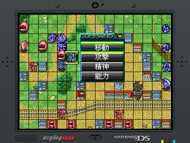 |
|-|

&nbsp;

##### Mode 1
Screen Resolution: 288x208  
Background Image: bg_s0.png
| 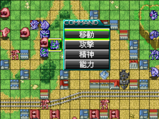 |
|-|

&nbsp;

##### Mode 2
Screen Resolution: 320x240
|  |
|-|

&nbsp;

#### DraStic Menu
Original Main Menu
|  |
|-|

&nbsp;

Refined Main Menu
| 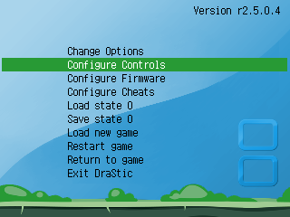 |
|-|

&nbsp;

Original Cheat Menu
|  |
|-|

&nbsp;

Refined Cheat Menu
|  |
|-|

&nbsp;

#### Hotkeys
|  Keys         | Functionality                     |
| ------------- | --------------------------------- |
| MENU + LEFT   | Change Keypad mode / Stylus mode  |
| MENU + RIGHT  | Swap screen                       |
| MENU + L1     | Quick load state                  |
| MENU + R1     | Quick save state                  |
| MENU + START  | Exit from DraStic emulator        |

&nbsp;

**Keypad mode only**
| Keys          | Functionality                               |
| ------------- | ------------------------------------------- |
| MENU + SELECT | Enter DraStic menu                          |
| MENU + A      | Change display mode                         |
| MENU + X      | Take screenshot (Emus/drastic/screenshot)   |
| MENU + Y      | Change background image                     |

&nbsp;

**Stylus mode only**
| Keys     | Functionality                   |
| -------- | ------------------------------- |
| DPAD     | Move the stylus pen             |
| A        | Touch screen                    |
| R1       | Lower moving speed              |
| MENU + Y | Change stylus pen               |

&nbsp;

### Build from Scratch
#### How to prepare the build environment (Docker)
```
$ sudo docker build -t mmiyoo .
```

#### How to build all libraries
```
$ sudo docker run -it --rm -v $(pwd):/nds_miyoo mmiyoo /bin/bash
# cd /nds_miyoo
# make config MOD=trimui
# make MOD=trimui
```

#### How to pack the release build
```
$ sudo docker run -it --rm -v $(pwd):/nds_miyoo mmiyoo /bin/bash
# cd /nds_miyoo
# make rel MOD=trimui
```

#### How to delete the build environment (Docker)
```
$ sudo docker image rm mmiyoo
```

&nbsp;

### Installation
```
1. Put drastic into Emus folder
2. Put ROMs into Roms/NDS folder
```

&nbsp;

### Limitations
 - Screen orientation **MUST** be set as **single** in DraStic menu as the following image  
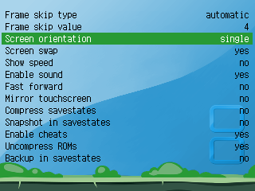

&nbsp;

### Special Thanks
```
河馬
路人乙
背包胖熊
DraStic Development Team
```
