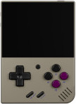
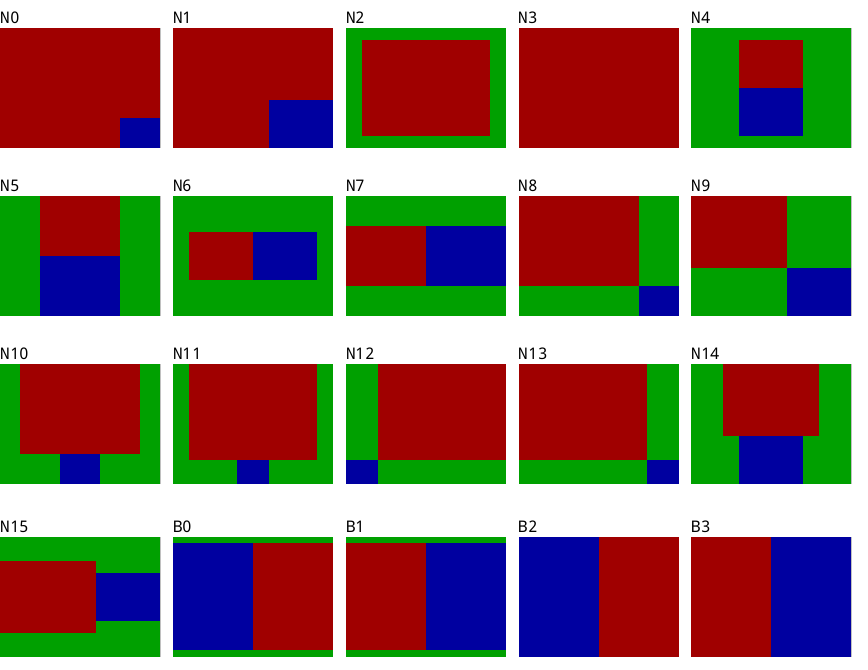
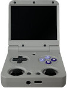
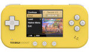
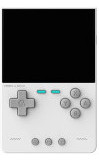
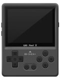
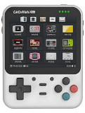
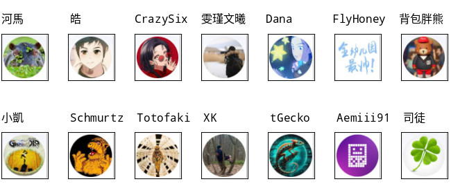

# NDS Emulator (DraStic) for Handheld Devices
This repository contains all necessary resources - including the customized SDL2 and ALSA source code - required for supported devices. The NDS emulator used in this project is DraStic (closed-source), extracted from the RetroPie package. The provided ELF binary is compiled for ARM32, not AArch64. The specific DraStic version is v2.5.0.4 with the SHA-1 checksum **ae9c215bdea88359cbcb3c259ce0d60a1f59986c**. This port primarily focuses on integrating and customizing the SDL2 and ALSA libraries, along with extensive modifications to the DraStic emulator itself. As a result, several internal hooking points are used to ensure proper functionality. Please ensure that you are using the exact DraStic version specified above. Suggestions and issue reports are welcome via GitHub. However, please note that I cannot guarantee that all reported issues or feature requests will be resolved or included in future release builds. Finally, since the SDL2 library in this repository is heavily customized, it is not recommended for general-purpose use on other supported devices.

 - [Miyoo Mini Plus](#miyoo-mini-plus)
 - [Miyoo Flip](#miyoo-flip)
 - [Trimui Smart](#trimui-smart)
 - [Trimui Brick](#trimui-brick)
 - [GKD Pixel 2](#gkd-pixel-2)  
 - [GKD Mini Plus](#gkd-mini-plus)
 - [Credits](#credits)

&nbsp;

## Miyoo Mini Plus
  

Device
```
Model: MY354  
Operating System: 202305052130 Onion_v4.3.1-1  
```  

Building Source
```
# Debian 12

$ cd
$ wget https://github.com/steward-fu/website/releases/download/miyoo-mini/mini_toolchain-v1.0.tar.gz
$ tar xvf mini_toolchain-v1.0.tar.gz
$ sudo mv mini /opt
$ sudo mv prebuilt /opt

$ git clone https://github.com/steward-fu/nds
$ cd nds
$ make -f Makefile.miyoo_mini clean
$ make -f Makefile.miyoo_mini
```

Installation
```
Copy the "drastic" folder to "Emu/"
```

Layout  
  

Button
| ( Keypad Mode )       | (Function)                          |
| --------------------- | ----------------------------------- |
| R2                    | Swap Screen                         |
| L2                    | Switch Keypad or Touch Mode         |
| HOTKEY + UP           | Toggle Microphone                   |
| HOTKEY + DOWN         | Toggle LCD Hinge                    |
| HOTKEY + LEFT         | Change Layout Mode                  |
| HOTKEY + RIGHT        | Change Layout Mode                  |
| HOTKEY + A            | Alternate Layout Mode               |
| HOTKEY + B            | Change Filter (Blur or Pixel)       |
| HOTKEY + Y            | Change Background Image             |
| HOTKEY + L1           | Quit Emulator                       |
| HOTKEY + L2           | Load State                          |
| HOTKEY + R1           | Fast Forward                        |
| HOTKEY + R2           | Save State                          |
| HOTKEY + SELECT       | Enter DraStic Menu                  |
| HOTKEY + START        | Enter SDL2 Menu                     |  
| ( Touch Mode )        |                                     |
| DPAD                  | Move Touch                          |
| A                     | Touch Screen                        |
| R1                    | Lower Moving Speed                  |
| HOTKEY + Y            | Change Touch Image                  |  
| ( SDL2 Menu )         |                                     |
| HOTKEY + Y            | Change Background Image             |  
| ( DraStic Menu )      |                                     |
| HOTKEY + Y            | Change Background Image             |

P.S. The HOTKEY is user-configurable and can be rebound to the MENU or SELECT key via the SDL2 menu.  

&nbsp;

## Miyoo Flip
  
Model: MY355  
Operating System: 20250526143414  
Installation:
```
Copy the "drastic" folder to "Emu/"
```
  
Layout  
  

&nbsp;

The HOTKEY is user-configurable and can be rebound to the MENU or SELECT key via the SDL2 menu.  

| ( Keypad Mode )       | (Function)                          |
| --------------------- | ----------------------------------- |
| R2                    | Swap Screen                         |
| L2                    | Switch Keypad or Touch Mode         |
| HOTKEY + UP           | Toggle Microphone                   |
| HOTKEY + DOWN         | Toggle LCD Hinge                    |
| HOTKEY + LEFT         | Change Layout Mode                  |
| HOTKEY + RIGHT        | Change Layout Mode                  |
| HOTKEY + A            | Alternate Layout Mode               |
| HOTKEY + B            | Change Filter (Blur or Pixel)       |
| HOTKEY + Y            | Change Background Image             |
| HOTKEY + L1           | Quit Emulator                       |
| HOTKEY + L2           | Load State                          |
| HOTKEY + R1           | Fast Forward                        |
| HOTKEY + R2           | Save State                          |
| HOTKEY + SELECT       | Enter DraStic Menu                  |
| HOTKEY + START        | Enter SDL2 Menu                     |  
| ( Touch Mode )        |                                     |
| DPAD                  | Move Touch                          |
| A                     | Touch Screen                        |
| R1                    | Lower Moving Speed                  |
| HOTKEY + Y            | Change Touch Image                  |  
| ( SDL2 Menu )         |                                     |
| HOTKEY + Y            | Change Background Image             |  
| ( DraStic Menu )      |                                     |
| HOTKEY + Y            | Change Background Image             |

&nbsp;

## Trimui Smart
  
Model: TG2040  
Operating System: 1.0.0 UI_20240510 Kernel_3.4.39  
Installation:
```
Copy the "drastic" folder to "Emus/"
```
  
Layout N0  
  

Layout N1  
  

&nbsp;

| ( Keypad Mode )       | (Function)                          |
| --------------------- | ----------------------------------- |
| MENU + UP             | Toggle Microphone                   |
| MENU + DOWN           | Toggle LCD Hinge                    |
| MENU + RIGHT          | Swap Screen                         |
| MENU + LEFT           | Switch Keypad or Touch Mode         |
| MENU + A              | Change Layout Mode                  |
| MENU + Y              | Change Background Image             |
| MENU + L1             | Sabe State                          |
| MENU + R1             | Load State                          |
| MENU + SELECT         | Enter DraStic Menu                  |
| MENU + START          | Quit Emulator                       |  
| ( Touch Mode )        |                                     |
| DPAD                  | Move Touch                          |
| A                     | Touch Screen                        |
| R1                    | Lower Moving Speed                  |
| MENU + Y              | Change Touch Image                  |  
| ( DraStic Menu )      |                                     |
| MENU + Y              | Change Background Image             |

&nbsp;

## Trimui Brick
  
Model: TG3040  
Operating System: 1.1.0 UI_20250610 Kernel_4.9.191  
Installation:
```
Copy the "drastic" folder to "Emus/"
```
  
Layout  
  

&nbsp;

The HOTKEY is user-configurable and can be rebound to the MENU or SELECT key via the SDL2 menu.  

| ( Keypad Mode )       | (Function)                          |
| --------------------- | ----------------------------------- |
| F1                    | Save State                          |
| F2                    | Load State                          |
| R2                    | Swap Screen                         |
| L2                    | Switch Keypad or Touch Mode         |
| HOTKEY + UP           | Toggle Microphone                   |
| HOTKEY + DOWN         | Toggle LCD Hinge                    |
| HOTKEY + LEFT         | Change Layout Mode                  |
| HOTKEY + RIGHT        | Change Layout Mode                  |
| HOTKEY + A            | Alternate Layout Mode               |
| HOTKEY + B            | Change Filter (Blur or Pixel)       |
| HOTKEY + Y            | Change Background Image             |
| HOTKEY + L1           | Quit Emulator                       |
| HOTKEY + L2           | Save State                          |
| HOTKEY + R1           | Fast Forward                        |
| HOTKEY + R2           | Load State                          |
| HOTKEY + SELECT       | Enter DraStic Menu                  |
| HOTKEY + START        | Enter SDL2 Menu                     |  
| ( Touch Mode )        |                                     |
| DPAD                  | Move Touch                          |
| A                     | Touch Screen                        |
| R1                    | Lower Moving Speed                  |
| HOTKEY + Y            | Change Touch Image                  |  
| ( SDL2 Menu )         |                                     |
| HOTKEY + Y            | Change Background Image             |  
| ( DraStic Menu )      |                                     |
| HOTKEY + Y            | Change Background Image             |

&nbsp;

## GKD Pixel 2
  
Model: GKD Pixel 2  
Operating System: IUX UI_v2.5_Jan_15_2025 Kernel_5.10.198  
Installation:
```
1. Copy the "drastic" folder to "STORAGE/"
2. Copy the "14nds" file to "STORAGE/iux/sections/handheld/14nds"
```
  
Layout  
  

&nbsp;

The HOTKEY is user-configurable and can be rebound to the MENU or SELECT key via the SDL2 menu.  

| ( Keypad Mode )       | (Function)                          |
| --------------------- | ----------------------------------- |
| R2                    | Swap Screen                         |
| L2                    | Switch Keypad or Touch Mode         |
| HOTKEY + UP           | Toggle Microphone                   |
| HOTKEY + DOWN         | Toggle LCD Hinge                    |
| HOTKEY + LEFT         | Change Layout Mode                  |
| HOTKEY + RIGHT        | Change Layout Mode                  |
| HOTKEY + A            | Alternate Layout Mode               |
| HOTKEY + B            | Change Filter (Blur or Pixel)       |
| HOTKEY + Y            | Change Background Image             |
| HOTKEY + L1           | Quit Emulator                       |
| HOTKEY + L2           | Load State                          |
| HOTKEY + R1           | Fast Forward                        |
| HOTKEY + R2           | Save State                          |
| HOTKEY + SELECT       | Enter DraStic Menu                  |
| HOTKEY + START        | Enter SDL2 Menu                     |  
| ( Touch Mode )        |                                     |
| DPAD                  | Move Touch                          |
| A                     | Touch Screen                        |
| R1                    | Lower Moving Speed                  |
| HOTKEY + Y            | Change Touch Image                  |  
| ( SDL2 Menu )         |                                     |
| HOTKEY + Y            | Change Background Image             |  
| ( DraStic Menu )      |                                     |
| HOTKEY + Y            | Change Background Image             |

&nbsp;

## GKD Mini Plus
  
Model: GKD Mini Plus   
Operating System: IUX Jul_14_2025  
Installation:
```
1. Copy the "drastic" folder to "STORAGE/"
2. Copy the "14nds" file to "STORAGE/miniplus/sections/02handheld/14nds"
```
  
Layout  
  

&nbsp;

The HOTKEY is user-configurable and can be rebound to the F1 or SELECT key via the SDL2 menu.  

| ( Keypad Mode )       | (Function)                          |
| --------------------- | ----------------------------------- |
| R2                    | Swap Screen                         |
| L2                    | Switch Keypad or Touch Mode         |
| HOTKEY + UP           | Toggle Microphone                   |
| HOTKEY + DOWN         | Toggle LCD Hinge                    |
| HOTKEY + LEFT         | Change Layout Mode                  |
| HOTKEY + RIGHT        | Change Layout Mode                  |
| HOTKEY + A            | Alternate Layout Mode               |
| HOTKEY + B            | Change Filter (Blur or Pixel)       |
| HOTKEY + Y            | Change Background Image             |
| HOTKEY + L1           | Quit Emulator                       |
| HOTKEY + L2           | Load State                          |
| HOTKEY + R1           | Fast Forward                        |
| HOTKEY + R2           | Save State                          |
| HOTKEY + SELECT       | Enter DraStic Menu                  |
| HOTKEY + START        | Enter SDL2 Menu                     |  
| ( Touch Mode )        |                                     |
| DPAD                  | Move Touch                          |
| A                     | Touch Screen                        |
| R1                    | Lower Moving Speed                  |
| HOTKEY + Y            | Change Touch Image                  |  
| ( SDL2 Menu )         |                                     |
| HOTKEY + Y            | Change Background Image             |  
| ( DraStic Menu )      |                                     |
| HOTKEY + Y            | Change Background Image             |

&nbsp;

## Credits
  
