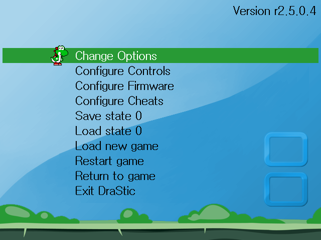

## NDS Emulator (DraStic) for Miyoo Mini (Plus) and TRIMUI SMART
 - [Miyoo Mini (Plus)](#miyoo-mini-plus)
   - [Introduction](#introduction)
   - [Terminology](#terminology)
   - [New Features](#new-features)
     - [Display Modes (Normal Resolution)](#display-modes-normal-resolution)
       - [Mode 0 - 640x480, 170x128](#mode-0)
       - [Mode 1 - 640x480, 256x192](#mode-1)
       - [Mode 2 - 512x384](#mode-2)
       - [Mode 3 - 640x480](#mode-3)
       - [Mode 4 - 256x192, 256x192](#mode-4)
       - [Mode 5 - 320x240, 320x240](#mode-5)
       - [Mode 6 - 256x192, 256x192](#mode-6)
       - [Mode 7 - 320x240, 320x240](#mode-7)
       - [Mode 8 - 480x360, 160x120](#mode-8)
       - [Mode 9 - 384x288, 256x192](#mode-9)
       - [Mode 10 - 384x288, 256x192](#mode-10)
       - [Mode 11 - 384x288, 256x192](#mode-11)
       - [Mode 12 - 427x320, 427x320](#mode-12)
       - [Mode 13 - 427x320, 427x320](#mode-13)
     - [Display Modes (High Resolution)](#display-modes-high-resolution)
       - [Mode 0 - 512x384](#mode-0)
       - [Mode 1 - 640x480](#mode-1)
     - [Video Filters](#video-filters)
       - [Pixel](#pixel) 
       - [Blur](#blur)
     - [Refined Menu](#refined-menu)
     - [Hotkeys](#hotkeys)
   - [Build from Scratch](#build-from-scratch)
     - [How to prepare the build environment (Docker)](#how-to-prepare-the-build-environment-docker)
     - [How to build all libraries](#how-to-build-all-libraries)
     - [How to pack the release build](#how-to-pack-the-release-build)
     - [How to delete the build environment (Docker)](#how-to-delete-the-build-environment-docker)
   - [Installation](#installation)
   - [Limitations](#limitations)
   - [Special Thanks](#special-thanks)
   - [Q & A](#q--a)

## Miyoo Mini (Plus)
### Introduction
This repository hosts all of resources, which include SDL2 and ALSA source code, needed for NDS emulator on Miyoo Mini (Plus) handheld. The NDS emulator we used is DraStic emulator (close-source) that obtained from RetroPie package and the ELF binary is in ARM32 format, not AArch64. The DraStic version is v2.5.0.4 and sha1 is ae9c215bdea88359cbcb3c259ce0d60a1f59986c. In this porting, I focusd on SDL2 and ALSA libraries and heavily customized for DraStic emulator on Miyoo Mini (Plus) handheld. Therefore, there are some hooking points used in this emulator. To make sure it works as expected, please use the correct DraStic emulator. It is welcome to file any suggestion or issue to this GitHub but I must say that I cannot make sure whether it can be fixed. Since this porting is heavily customized, it is not recommended for generic use-case on Miyoo Mini (Plus) handheld.  

In DraStic emulator, it only supports 3 display modes, which are vertical, horizontal and single. In order to improve user experience on Miyoo Mini (Plus), I decided to heavily customize the display mode based on DraStic's vertical mode (Screen orientation). So, the "Screen orientation" MUST be set as vertical to make sure all of operations work on Miyoo Mini (Plus). In current design, there are 13 display modes for normal resolution (256x192) and 2 display modes for high resolution (512x384). All of display modes are addressed as the following description.

&nbsp;

### Terminology
|  Term             | Description                                                |
| ----------------- | ---------------------------------------------------------- |
| Keypad Mode       | This is the default mode and it is so-called gamepad mode. |
| Stylus Mode       | It is touch mode. In this mode, the touch pen shows on either top or bottom screen. DPAD is used to move touch pen and A button acts touch point. | 
| Normal Resolution | This is the default display mode and the display resolution is 256x192 pixels. If user doesn't turn on High-resolution mode in DraStic menu, it is the Normal Resolution. |
| High Resolution   | Turn on "Change Options -> High-resolution 3D" in DraStic menu and then the display resolution will be changed to 512x384 pixels. In this mode, only single screen is rendered. |

&nbsp;

### New Features
#### Display Modes (Normal Resolution)
##### Mode 0
Screen Resolution: 640x480, 170x128
|  |
|-|

&nbsp;

##### Mode 1
Screen Resolution: 640x480, 256x192
|  |
|-|

&nbsp;

##### Mode 2
Screen Resolution: 512x384  
Background Image: bg_s0.png
|  |
|-|

&nbsp;

##### Mode 3
Screen Resolution: 640x480
|  |
|-|

&nbsp;

##### Mode 4
Screen Resolution: 256x192, 256x192  
Background Image: bg_v0.png
|  |
|-|

&nbsp;

##### Mode 5
Screen Resolution: 320x240, 320x240  
Background Image: bg_v1.png
|  |
|-|

&nbsp;

##### Mode 6
Screen Resolution: 256x192, 256x192  
Background Image: bg_h0.png
|  |
|-|

&nbsp;

##### Mode 7
Screen Resolution: 320x240, 320x240  
Background Image: bg_h1.png
|  |
|-|

&nbsp;

##### Mode 8
Screen Resolution: 480x360, 160x120  
Background Image: bg_vh_s0.png
|  |
|-|

&nbsp;

##### Mode 9
Screen Resolution: 384x288, 256x192  
Background Image: bg_vh_s1.png
|  |
|-|

&nbsp;

##### Mode 10
Screen Resolution: 384x288, 256x192  
Background Image: bg_vh_c0.png
|  |
|-|

&nbsp;

##### Mode 11
Screen Resolution: 384x288, 256x192  
Background Image: bg_vh_c1.png
|  |
|-|

&nbsp;

##### Mode 12
Screen Resolution: 427x320, 427x320  
Background Image: bg_hh0.png
|  |
|-|

&nbsp;

##### Mode 13
Screen Resolution: 427x320, 427x320  
Background Image: bg_hh0.png
|  |
|-|

&nbsp;

#### Display Modes (High Resolution)
##### Mode 0
Screen Resolution: 512x384  
Background Image: bg_hres0.png
|  |
|-|

&nbsp;

##### Mode 1
Screen Resolution: 640x480
|  |
|-|

&nbsp;

#### Video Filters
##### Pixel
|  |
|-|

&nbsp;

##### Blur
|  |
|-|

&nbsp;

#### Refined Menu
Original Main Menu
|  |
|-|

&nbsp;

Refined Main Menu
|  |
|-|

&nbsp;

Original Cheat Menu
|  |
|-|

&nbsp;

Refined Cheat Menu
|  |
|-|

&nbsp;

#### Hotkeys
|  Keys (Onion) | Keys (Stock)   | Functionality                    |
| ------------- | -------------- | -------------------------------- |
| R2            | R2             | Swap screen                      |
| L2            | L2             | Change Keypad mode / Stylus mode |
|MENU + R1      | SELECT + R1    | Fast forward                     |
|MENU + R2      | SELECT + R2    | Quick save state                 |
|MENU + L2      | SELECT + L2    | Quick load state                 |
|MENU + L1      | SELECT + L1    | Exit DraStic emulator            |
|MENU + START   | SELECT + START | Enter the customized menu        |
|MENU + LEFT    | SELECT + LEFT  | Change the display mode          |
|MENU + RIGHT   | SELECT + RIGHT | Change the display mode          |

&nbsp;

**Customized menu only**
|  Keys (Onion) | Keys (Stock)   | Functionality                    |
| ------------- | -------------- | -------------------------------- |
| UP / DOWN     | UP / DOWN      | Select item                      |
| LEFT / RIGHT  | LEFT / RIGHT   | Change setting                   |
| B             | B              | Apply changes and then exit      |

&nbsp;

**Keypad mode only**
|  Keys (Onion) | Keys (Stock)   | Functionality                       |
| ------------- | -------------- | ----------------------------------- |
| MENU + SELECT | MENU           | Enter DraStic menu                  |
| MENU + A      | SELECT + A     | Alternate display mode              |
| MENU + B      | SELECT + B     | Change video filter (blur or pixel) |
| MENU + Y      | SELECT + Y     | Change background image             |

&nbsp;

**Stylus mode only**
|  Keys (Onion) | Keys (Stock)   | Functionality                   |
| ------------- | -------------- | ------------------------------- |
| DPAD          | DPAD           | Move the stylus pen             |
| A             | A              | Touch screen                    |
| R1            | R1             | Lower moving speed              |
| MENU + Y      | SELECT + Y     | Change stylus pen               |
| MENU + UP     | SELECT + UP    | Show the stylus pen on screen 1 |
| MENU + DOWN   | SELECT + DOWN  | Show the stylus pen on screen 0 |

&nbsp;

### Build from Scratch
#### How to prepare the build environment (Docker)
```
$ sudo docker build -t mmiyoo .
```

#### How to build all libraries
```
$ sudo docker run -it --rm -v $(pwd):/nds_miyoo mmiyoo /bin/bash
$ make config
$ make
```

#### How to pack the release build
```
$ sudo docker run -it --rm -v $(pwd):/nds_miyoo mmiyoo /bin/bash
$ make rel
```

#### How to delete the build environment (Docker)
```
$ sudo docker image rm mmiyoo
```

&nbsp;

### Installation
```
1. put drastic into Emu folder
2. put ROMs into Roms/NDS folder
```

&nbsp;

### Limitations
 - Screen orientation **MUST** be set as **vertical** in DraStic menu as the following image because all of display modes are handled by SDL2 library, not DraStic emulator  


&nbsp;

### Special Thanks
```
河馬
路人乙
背包胖熊
Miyoo Mini 掌機 QQ 群 (742661857)
Onion Development Team
DraStic Development Team
```

&nbsp;

### Q & A
**Q1: How to change the DraStic menu back to the original one ?**
```
Change the "cust_menu" value in "resources/settings.json" file to 0.
``` 

&nbsp;

**Q2: How to change the language to another one ?**
```
As the following steps:
Step 1: add the new translation file in "resources/translate" folder, ex: resources/translate/jp
Step 2: change the "lang" value in "resources/settings.json" file to match your language, ex: "lang":"jp"
Step 3: update font.ttf file which supports your taregt language in "resources/font" folder
```

&nbsp;


**Q3: How to rotate the keys (DPAD and 4 function keys) to 90 degree ?**
```
Go to the customized menu and then change "Keys" setting.
```

&nbsp;

**Q4: How to customize the DraStic menu ?**
```
All images are put in "resources/menu" folder.
The color can be changed in "resources/settings.json" file as the following:
    "menu_c0":"0xffffff"    Text color when select
    "menu_c1":"0x000000"    Text color when un-select
    "menu_c2":"0x289a35"    Highlight color
```

&nbsp;

**Q5: How to swap L1 and L2 keys ?**
```
Change the "swap_l1l2" value in "resources/settings.json" file.
```

&nbsp;

**Q6: How to swap R1 and R2 keys ?**
```
Change the "swap_r1r2" value in "resources/settings.json" file.
```

&nbsp;

**Q7: How to apply the overlay image ?**
```
Put image in "resources/overlay" folder.
Go to the customized menu and then change the "OVERLAY" setting to apply the new setting.
Please note that the wallpaper will be disabled when the "OVERLAY" setting is enabled.
```

&nbsp;

**Q8: How to change the moving speed for stylus pen ?**
```
Change the "xv" and "yv" values in "resources/settings.json" file.  
Speed (X axis) = (time_cur – time_init) / xv  
Speed (Y axis) = (time_cur – time_init) / yv  
```

&nbsp;

**Q9: How to change the initial CPU clock ?**
```
Change "./cpuclock 1500" to what you want. (1500 = 1500MHz = 1.5GHz)  
For Miyoo Mini, the maximum CPU clock should be <= 1550MHz (experimental value)  
For Miyoo Mini Plus, the maximum CPU clock should be <= 1850MHz (experimental value)  
```

&nbsp;

**Q10: How to change the maximum/minimum CPU clock ?**
```
Change the "maxcpu"/"minpcu" value in "resources/settings.json" file.  
```

&nbsp;

**Q11: How to use the customized wallpaper (so-called background or theme image) ?**
```
All wallpapers are put in "resources/bg" folder.
```

&nbsp;

**Q12: How to use the customized stylus image ?**
```
All of stylus images are put in "resources/pen" folder.
The touch point is set by checking suffix file name.
For example, the file name of 1_lt.png means the touch point is at left-top (_lt).

User can replace the old ones or create the new image for stylus pen.
Here are all of supported positions:
    xxx_lb.png: left-bottom
    xxx_lt.png: left-top
    xxx_rb.png: right-bottom
    xxx_rt.png: right-top 
```

&nbsp;

**Q13: How to use the customized logo in DraStic menu ?**
```
Replace the images in "resources/logo" folder.
The resolution must be 400x150 pixels.
```

&nbsp;

**Q14: How to enable high resolution 3D mode ?**
```
Turn on "Hight-resolution 3D" settings in DraStic menu.
The display resolution will be changed as 512x384 pixels.
```

&nbsp;

**Q15: How to run the DraStic emulator on 752x560 resolution ?**
```
Change "USE_752x560_RES=1" in launch.sh file. By default, it is set as 0 (640x480 resolution)
```
