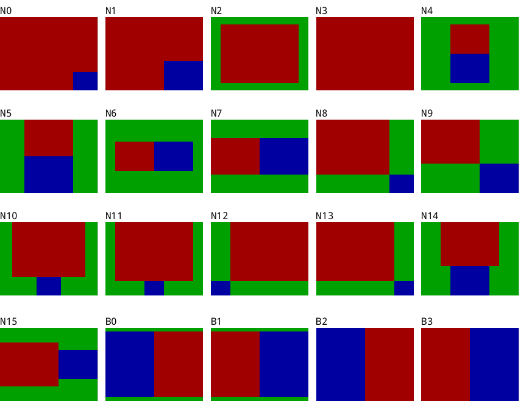

# NDS Emulator (DraStic) for Handheld Devices
This repository contains all necessary resources - including the customized SDL2 and ALSA source code - required for supported devices. The NDS emulator used in this project is DraStic (closed-source), extracted from the RetroPie package. The provided ELF binary is compiled for ARM32, not AArch64. The specific DraStic version is v2.5.0.4 with the SHA-1 checksum **ae9c215bdea88359cbcb3c259ce0d60a1f59986c**. This port primarily focuses on integrating and customizing the SDL2 and ALSA libraries, along with extensive modifications to the DraStic emulator itself. As a result, several internal hooking points are used to ensure proper functionality. Please ensure that you are using the exact DraStic version specified above. Suggestions and issue reports are welcome via GitHub. However, please note that I cannot guarantee that all reported issues or feature requests will be resolved or included in future release builds. Finally, since the SDL2 library in this repository is heavily customized, it is not recommended for general-purpose use on other supported devices.

 - [Motorola Photon Q](#motorola-photon-q)
 - [Unit Test](#unit-test)
 - [Credits](#credits)

&nbsp;

## Motorola Photon Q
  

Device
```
Model: XT897
Operating System: Sailfish OS 4.4.0.68
```

Building Source
```
# Sailfish OS 4.4.0.68

$ cd
$ git clone https://github.com/steward-fu/nds
$ cd nds
$ make -f Makefile.moto_xt897 clean
$ make -f Makefile.moto_xt897
```

Layout  
  

Button
| ( Keypad Mode )       | (Function)                          |
| --------------------- | ----------------------------------- |
| APOSTROPHE            | Swap Screen                         |
| BACKSPACE             | Switch Keypad or Touch Mode         |
| 1                     | Save State                          |
| 0                     | Load State                          |
| W                     | UP                                  |
| S                     | DOWN                                |
| A                     | LEFT                                |
| D                     | RIGHT                               |
| L                     | A                                   |
| K                     | B                                   |
| O                     | X                                   |
| I                     | Y                                   |
| Q                     | L1                                  |
| E                     | R1                                  |
| COMMA                 | SELECT                              |
| PERIOD                | START                               |
| SPACE + W             | Toggle Microphone                   |
| SPACE + S             | Toggle LCD Hinge                    |
| SPACE + A             | Change Layout Mode                  |
| SPACE + D             | Change Layout Mode                  |
| SPACE + L             | Alternate Layout Mode               |
| SPACE + K             | Change Filter (Blur or Pixel)       |
| SPACE + I             | Change Background Image             |
| ENTER                 | Quit Emulator                       |
| SPACE + COMMA         | Enter DraStic Menu                  |
| SPACE + PERIOD        | Enter SDL2 Menu                     |  
| ( Touch Mode )        |                                     |
| WASD                  | Move Touch                          |
| L                     | Touch Screen                        |
| E                     | Lower Moving Speed                  |
| SPACE + K             | Change Touch Image                  |  
| ( SDL2 Menu )         |                                     |
| SPACE + I             | Change Background Image             |  
| ( DraStic Menu )      |                                     |
| SPACE + I             | Change Background Image             |

&nbsp;

## Unit Test
Run Unit Test
```
$ make -f Makefile.ut
```

&nbsp;

## Credits
  
