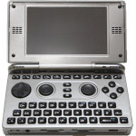

# NDS Emulator Based on DraStic Reverse Engineering

 - [OpenPandora](#openpandora)
 - [Motorola XT897](#motorola-photon-q)
 - [F(x)tec Pro1](#fxtec-pro1)
 - [Unit Test](#unit-test)
 - [Credits](#credits)

&nbsp;

## OpenPandora
  

Device
```
Model: Rebirth and Classic
Operating System: Angstrom 2010.4-test-20141019
```

&nbsp;

## Motorola Photon Q
  

Device
```
Model: XT897
Operating System: Sailfish OS 4.4.0.68
```

&nbsp;

## F(x)tec Pro1
  

Device
```
Model: QX1000
Operating System: Sailfish OS 4.4.0.72
```

&nbsp;

## Unit Test
Run Unit Test
```
$ make -f Makefile.ut
```

&nbsp;

## Credits
  
